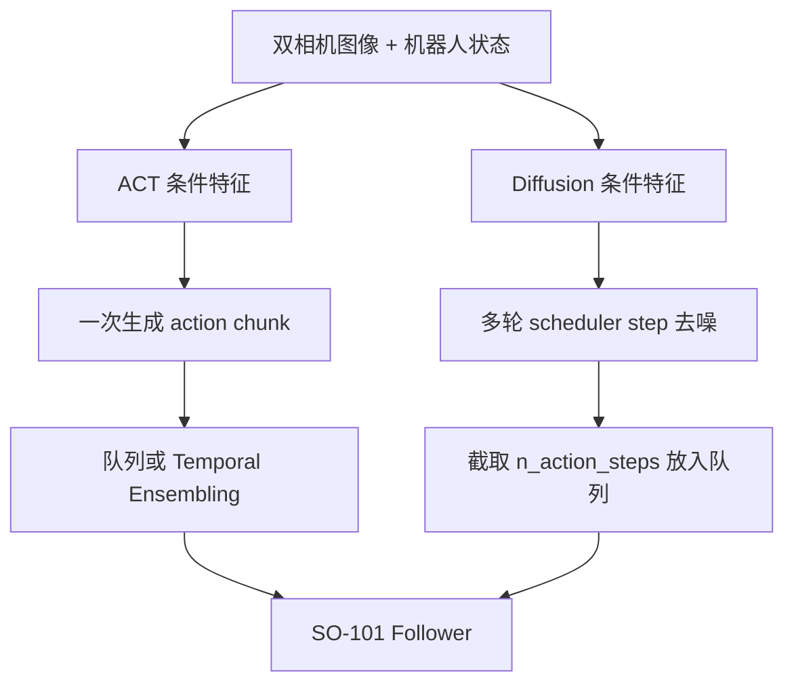

# ACT 与 Diffusion Policy：从实现到 SO-101 真机现象

这个分支整理我在 `Grab the glue` 任务中复刻 ACT 与 Diffusion Policy 后形成的算法理解。内容从双摄像头图像、机器人状态和动作示范出发，继续追到 LeRobot 的配置类、Policy 接口、训练损失和动作队列，并与原始论文及官方代码核对。

这里不会用单次视频替代定量实验，也不把当前上游源码默认值当成我训练 checkpoint 的实际配置。凡是“实验观察”“本次源码核对”“论文/原始代码结论”和“尚未验证的推断”，均尽量分开表述。

[返回 `main` 项目导航](https://github.com/Zeil6/lerobot-so101-imitation-learning/tree/main)

## 两个算法入口

| 入口 | 主要问题 | 与真机记录的连接 |
| --- | --- | --- |
| [ACT：动作分块、CVAE 与 Temporal Ensembling](docs/act.md) | `ACTPolicy.forward()` 与 `select_action()` 为什么不同；一个 chunk 如何训练、生成和消费 | 10 个 episode、双摄像头、CUDA OOM、视频中动作相对连续 |
| [Diffusion Policy：动作去噪、scheduler 与动作队列](docs/diffusion_policy.md) | 动作怎样加噪与去噪；`horizon`、`n_obs_steps`、`n_action_steps` 和推理步数如何共同影响控制 | 同一组 10-episode 数据、重新采集的 50-episode 数据、DDIM 16 步后的抽动变化 |

补充入口：

- [ACT 与 Diffusion Policy 实现对比](docs/implementation_comparison.md)
- [源码版本、论文与固定链接](docs/source_reference.md)

## 我现在怎样理解两条数据流

两种策略都使用示范学习，但“动作序列如何成为模型输出”不同：

ACT 当前实现用动作重建损失，并在启用 CVAE 时加入 KL 项；Diffusion Policy 则在随机 diffusion timestep 上学习预测噪声（默认 `epsilon`）或干净样本。两者都能输出一段动作，但 ACT 通常一次模型调用得到 chunk，而扩散策略每次生成新 chunk 要反复调用去噪网络。

## 快速对比

| 维度 | ACT | Diffusion Policy |
| --- | --- | --- |
| 序列建模 | Transformer 直接预测 action chunk | 条件 1D U-Net 迭代恢复动作序列 |
| 训练目标 | masked L1；启用 CVAE 时再加 `kl_weight × KL` | 对 `epsilon` 或 `sample` 的 MSE |
| 推理 latent | CVAE latent 取零，不再读取真实动作 | 从随机动作噪声开始 |
| 执行动作 | 普通队列消费 `n_action_steps`，或逐步做 Temporal Ensembling | 从 `horizon` 中截取 `n_action_steps` 放入队列 |
| 推理成本 | 通常一次前向生成一个 chunk | 每次生成 chunk 需要多轮 scheduler step |
| 多模态来源 | CVAE 对动作序列分布建模 | 扩散生成过程对动作分布建模 |
| 当前视频观察 | 10-episode 模型动作相对连续 | 10-episode 初版分段明显；50-episode 仍有轻微抽动；DDIM 16 步后抽动周期明显减小 |

“动作相对连续”不是成功率；“DDIM 16 步后周期减小”也不是动作连续性已经完全解决。完整比较见[实现对比](docs/implementation_comparison.md)。

## 版本边界

本次源码核对日期为 **2026-07-16**：

- LeRobot：[`3f2179f`](https://github.com/huggingface/lerobot/tree/3f2179f3b69708b6ad009b2e7685dd9d05269ee1)
- ACT 原始官方代码：[`742c753`](https://github.com/tonyzhaozh/act/tree/742c753c0d4a5d87076c8f69e5628c79a8cc5488)
- Diffusion Policy 原始官方代码：[`5ba07ac`](https://github.com/real-stanford/diffusion_policy/tree/5ba07ac6661db573af695b419a7947ecb704690f)

这些 SHA 是“本次整理时检查的基线”，不等同于我当时训练使用的精确 LeRobot SHA。一个已经确认的版本差异是：我的实验记录对应版本只接受 `crop_shape`，而本次检查的 LeRobot 上游还包含 `resize_shape` 和 `crop_ratio`。因此文档同时保留实验配置和新源码事实，不用后者回写前者。

## 推荐阅读顺序

1. 先读 [ACT](docs/act.md) 或 [Diffusion Policy](docs/diffusion_policy.md) 的独立数据流。
2. 再读[实现对比](docs/implementation_comparison.md)，把推理耗时、动作块和闭环频率放在同一张表里。
3. 最后通过[源码与论文索引](docs/source_reference.md)复查文件、类、函数和版本边界。

## 已确认与仍需验证

已确认的实验事实：ACT 和第一版 Diffusion Policy 使用同一组 10 个 episode；第二版 Diffusion Policy 使用重新采集的 50 个 episode；50-episode 模型仍有轻微抽动；改用 DDIM、`num_inference_steps=16` 后抽动周期明显减小。

仍需验证：统一条件下的成功率与完成时间、DDIM 10/16 步对比、不同 `n_action_steps`、多个 checkpoint、统一视觉裁剪后的重训，以及 Temporal Ensembling 或动作块融合的独立贡献。π0.5 与 SmolVLA 尚未完成，不属于本分支的成果入口。
