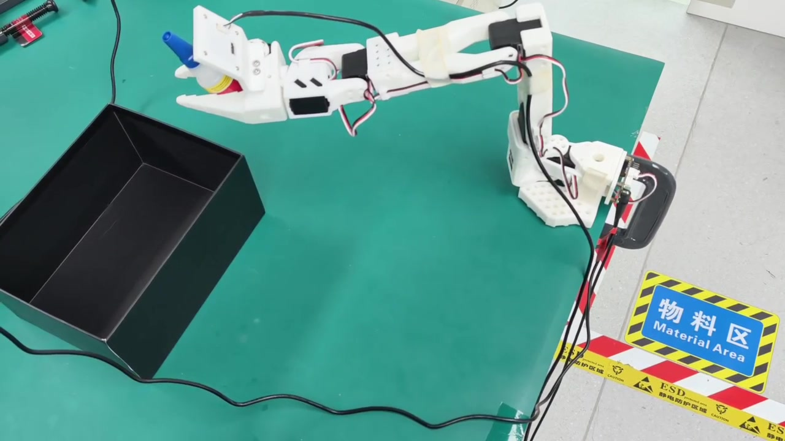
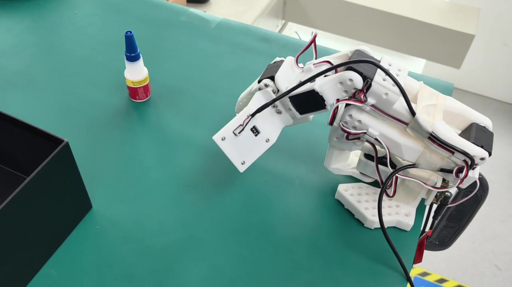

# Diffusion Policy 复刻：训练之外的实时部署问题

本分支记录我在同一套 SO-101 数据上训练和部署 Diffusion Policy 的过程。基本训练和真机部署已经完成；初始部署出现周期性停顿与抽动，改用 DDIM 16 步并关闭显示、启用 AMP 后，抽动周期明显减小。这个现象支持“推理延迟是主要原因之一”，但不意味着动作块边界、数据质量和通信因素已经被完全排除。

[返回 `main` 项目导航](https://github.com/Zeil6/lerobot-so101-imitation-learning/tree/main)

## 数据复用边界

- ACT 与 Diffusion Policy 可以使用同一个 LeRobot 数据集。
- 数据集保存的是图像、机器人状态、动作和任务信息，并不从属于某个策略。
- ACT 权重不能转换成 Diffusion Policy 权重；两者网络结构和训练目标不同。
- 我先复用 ACT 的同一组 10 个 episode 验证流程，后来重新采集 50 个 episode。
- 50-episode 数据没有自动消除抽动，因此我把注意力从“只有数据量不足”转向部署推理链路。

## 文档导航

- [`docs/training-deployment.md`](docs/training-deployment.md)：数据复用、训练、checkpoint 与部署流程。
- [`docs/inference-analysis.md`](docs/inference-analysis.md)：周期性停顿、动作队列和 DDPM/DDIM 分析。
- [`docs/image-and-algorithm.md`](docs/image-and-algorithm.md)：图像裁剪、Diffusion Policy 原理与反思。

## 不同数据规模下的真机演示

### Diffusion Policy：10 个 episode

该模型使用与 ACT 相同的 10 个示范 episode 训练，任务为 `Grab the glue`。这样做的目的，是先在较接近的数据条件下观察两种策略在真机部署阶段的差异。

[](assets/videos/diffusion_policy_so101_10ep_demo.mp4)

[▶ 查看 10-episode Diffusion Policy 真机演示](assets/videos/diffusion_policy_so101_10ep_demo.mp4)

我在这一阶段观察到机械臂存在较明显的分段运动或周期性抽动。最初我倾向于认为数据量不足是主要原因，但后续实验让我修正了这一判断：推理步数、动作队列执行方式和控制延迟同样是重要变量。

### Diffusion Policy：50 个 episode

为了检查数据规模是否是主要限制，我重新采集了 50 个 episode，并使用这批新数据重新训练 Diffusion Policy。它不是从原来 10 个 episode 简单复制或扩增得到的数据。

[](assets/videos/diffusion_policy_so101_50ep_demo.mp4)

[▶ 查看 50-episode Diffusion Policy 真机演示](assets/videos/diffusion_policy_so101_50ep_demo.mp4)

数据量增加后，模型接触到了更多示范轨迹，但真机运行中仍能观察到一定程度的轻微抽动。这说明增加 episode 数量不能自动解决扩散模型的实时推理延迟和动作块边界问题；同时，由于 50 个 episode 是重新采集的，DP 10ep 与 DP 50ep 之间还可能存在示范分布变化，不能把这两段视频当成完全控制变量的定量实验。

进一步检查部署过程后，我使用了：

```text
noise_scheduler_type=DDIM
num_inference_steps=16
use_amp=true
display_data=false
```

修改后抽动周期明显减小，但没有证据表明动作连续性问题已经完全解决。

### 三段演示的阶段性对照

| 演示 | 算法 | 训练数据 | 数据来源 | 视频中的实际观察 |
| --- | --- | --- | --- | --- |
| [ACT 10ep](https://github.com/Zeil6/lerobot-so101-imitation-learning/tree/act-reproduction) | ACT | 10 episodes | 原始同一组数据 | 动作相对连续 |
| [DP 10ep](assets/videos/diffusion_policy_so101_10ep_demo.mp4) | Diffusion Policy | 10 episodes | 与 ACT 相同 | 初始部署存在较明显分段运动 |
| [DP 50ep](assets/videos/diffusion_policy_so101_50ep_demo.mp4) | Diffusion Policy | 50 episodes | 重新采集 | 数据增加后仍有轻微抽动 |

“动作相对连续”是视频观察，不等同于已经验证出较高成功率。三段视频主要用于记录复刻过程和判断变化，不是严格的定量对照实验。

## 我的判断如何变化

1. 我先使用 10 个 episode 跑通 ACT，真机动作相对连续。
2. 我复用同一组数据训练 Diffusion Policy，观察到明显分段运动。
3. 我最初认为 Diffusion Policy 的抽动主要是数据太少。
4. 我重新采集 50 个 episode 并重新训练，但轻微抽动仍然存在。
5. 因此我开始检查部署推理过程，而不是继续把所有问题归因于数据量。
6. 将 DDPM 改为 DDIM，并设置 16 个推理步骤后，抽动周期明显减小。
7. 这让我意识到，数据规模、推理延迟、动作块长度和控制频率需要分开分析。

## 阶段性结论

- 同一原始数据可用于 ACT 和 Diffusion Policy，但需要分别训练权重。
- Diffusion Policy 的真机表现对推理步数、动作队列长度和视觉预处理更敏感。
- 从 100 步 DDPM 形态调整为 DDIM 16 步后，停顿/抽动周期明显缩短，说明推理时间是核心变量之一。
- 增加 episode 不能自动解决计算延迟；数据问题和实时性问题必须分开验证。

## 尚未完成

- 对 DDIM 10 步和 16 步做同条件重复测试并记录实际推理时间。
- 重新确定双摄像头裁剪区域，训练输入一致的新 checkpoint。
- 系统比较不同 `n_action_steps` 和多个 checkpoint。
- 验证动作块融合、动作平滑和更高频闭环是否必要。
