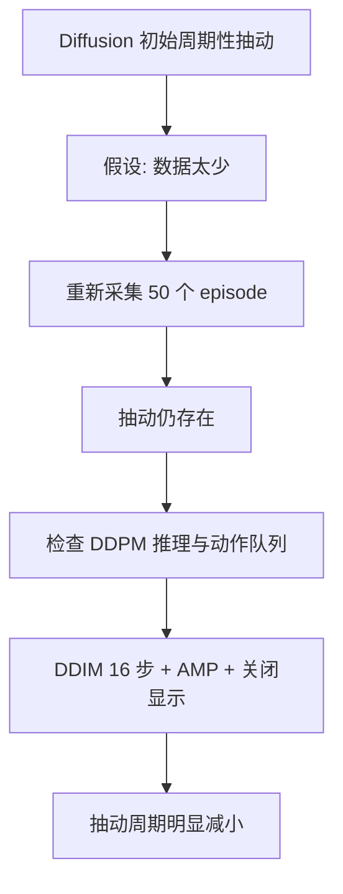

# ACT 与 Diffusion Policy 阶段性实验复盘

这个分支把“我观察到了什么”和“我还想验证什么”分开。ACT 与 Diffusion Policy 已经完成基本训练和部署流程，但目前没有足够的重复实验支撑准确成功率，也没有理由把某一次成功或失败上升为算法结论。

[返回 `main` 项目导航](https://github.com/Zeil6/lerobot-so101-imitation-learning/tree/main)

## 实验任务与控制变量

- 任务：SO-101 抓取胶水（`Grab the glue`）。
- 硬件：同一套 Leader/Follower、Feetech 舵机、`handeye` 与 `fixed` 双摄像头。
- 数据：两种策略复用同一 LeRobot 原始数据；权重分别训练。
- 计算设备：RTX 5060 Ti 16GB。
- 当前比较目的：先确定两条链路可运行，并识别影响真机表现的主要工程变量。

保持同一数据并不自动构成严格公平对比。还应固定 checkpoint 选择方法、初始位姿、目标位置、控制频率、图像预处理、推理参数和重复次数。

## 实验过程中的判断变化

我最初把真机抽动主要归因于数据不足。扩充数据后问题仍在，迫使我把“动作本身学得不好”和“动作生成得太慢”分开。DDIM 16 步的变化说明推理延迟是核心变量之一，也让我意识到训练 loss 不能覆盖部署实时性。

## 已经得到的结论

以下内容有当前运行记录或直接观察支撑：

- ACT 和 Diffusion Policy 均完成基本训练与部署流程。
- 原始图像、状态和动作数据可以在两种算法间复用，权重不能复用。
- Diffusion Policy 改用 DDIM 16 步并减少部署开销后，抽动周期明显减小。
- 重新采集的 50 个 episode 没有自动解决全部抽动问题。
- 部署实时性和动作块衔接是重要影响因素。

“明显减小”目前是定性观察，不写成百分比；“重要影响因素”也不等于已经排除所有其他原因。

## 仍需继续验证

- 更合理图像裁剪后重新训练的效果。
- DDIM 10 步与 16 步的速度和动作质量差异。
- 不同 `n_action_steps` 对停顿、闭环纠偏和成功率的影响。
- 多 checkpoint 的系统性真机成功率。
- 是否需要动作平滑或重叠动作块融合。
- ACT Temporal Ensembling 在当前任务中的独立贡献。

## 下一轮评价指标

| 指标 | 记录方式 | 为什么需要 |
| --- | --- | --- |
| 任务成功率 | 固定条件下多次尝试，报告成功数/总次数 | 避免一次成功代表稳定 |
| 完成时间 | 从策略启动到稳定抓起/超时 | 反映效率与停顿 |
| 停顿或抽动次数 | 用统一阈值并结合视频/控制日志标注 | 量化主观“顺滑” |
| 抓取稳定性 | 抬起后保持固定时间，记录滑落 | 区分碰到目标和真正抓稳 |
| 初始位置变化 | 预定义多个目标位置分别测试 | 检查场景覆盖和泛化 |
| 失败后恢复 | 人为设置轻微偏差，记录是否重新接近 | 评估分布外与闭环能力 |
| 推理耗时 | 平均值、P95/P99 与最大值 | 判断动作队列是否可能耗尽 |

## 为什么要测试多个 checkpoint

`last` 只表示最后保存，不表示真机表现最好。训练 loss 可能继续下降，但策略也可能对采集分布过拟合，或在关键抓取阶段出现行为变化。下一轮应预先选择若干训练阶段的 checkpoint，在相同条件下重复测试，不能看完结果后只挑一次最好表现。

## 数据量、数据一致性与场景覆盖

这三个概念需要分开：

- 数据量回答“样本有多少”；
- 数据一致性回答“相似状态下示范是否互相冲突”；
- 场景覆盖回答“部署会遇到的变化是否在数据中出现”。

50 个高度重复的示范 episode 可能增加数量，却不一定改善目标位置变化后的表现。相反，盲目加入质量不一致的数据也可能让动作分布更难学。

## 数据规模变化与部署表现

### 已确认事实

- ACT 与第一版 Diffusion Policy 使用同一组 10-episode 数据。
- 后续重新采集 50 个 episode，训练了第二版 Diffusion Policy。
- 50-episode Diffusion Policy 在真机视频中仍存在轻微抽动。
- 使用 DDIM 16 步部署后，抽动周期明显减小。

### 不能直接得出的结论

- 不能只凭三个视频判断准确成功率。
- 不能证明 50-episode 模型在所有情况下优于 10-episode 模型。
- 不能把抽动完全归因于数据量。
- 不能把 DDIM 16 步写成完全解决了动作连续性问题。
- 由于 50 个 episode 是重新采集的，DP 10ep 与 DP 50ep 还可能存在数据分布变化，并非只改变了数据数量。

### 后续应补充的实验

- 对每个模型进行相同次数的真机测试。
- 固定物体初始位置与摄像头位置。
- 记录成功率、完成时间和动作停顿次数。
- 对比多个 checkpoint。
- 对比 DDIM 10 步和 16 步。
- 对比不同 `n_action_steps`。

## 计划中的实验矩阵

| 实验 | 固定项 | 自变量 | 主要观测 |
| --- | --- | --- | --- |
| DDIM 步数 | checkpoint、裁剪、控制频率、初始位姿 | 10 / 16 | 推理耗时、停顿、任务完成 |
| 动作执行长度 | checkpoint、DDIM 步数、初始位姿 | 多个 `n_action_steps` | 块边界、纠偏、停顿 |
| 图像裁剪 | 数据与其他训练配置 | 旧裁剪 / 经可视化确认的新裁剪 | 可见范围、成功和失败类型 |
| checkpoint | 任务条件、部署参数 | 多个训练阶段 | 成功率、稳定性、恢复 |

在真正执行前还需要给每个自变量写出精确取值和重复次数。目前没有发生的实验不会提前写成结果。

## 如果重新安排一次复刻

我会先用少量 episode 走通完整链路，再扩充数据；部署前先基准测试单次推理耗时；每次只改变一个关键变量，并同步记录配置、checkpoint、视频和失败类型。这样能减少“改了很多东西后虽然变好，却不知道是哪一项起作用”的情况。
