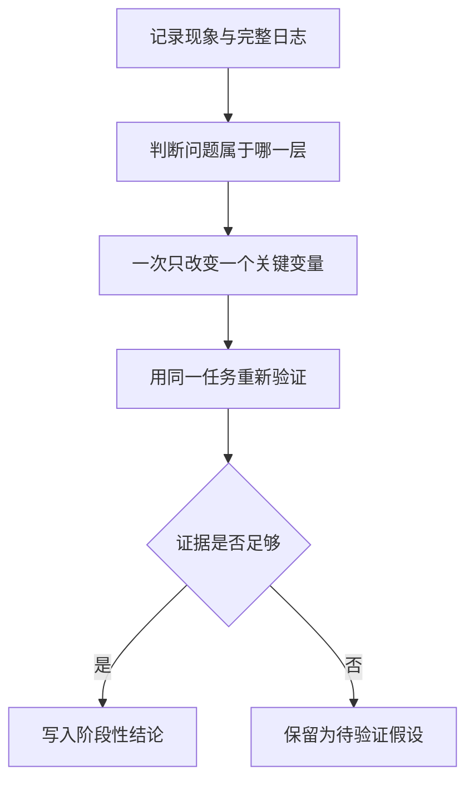

# LeRobot × SO-101 模仿学习复刻记录

这个仓库记录我在 SO-101 真机上复刻 LeRobot 模仿学习流程的过程。当前完成到的范围是：使用 Leader–Follower 系统和两路相机采集示范数据，分别完成 ACT 与 Diffusion Policy 的基本训练和真机部署，并围绕环境、数据、显存、推理延迟和动作分块做了阶段性排查。

这里不是一份只保留“最终正确命令”的教程。我更希望保留当时看到的现象、最初的判断、日志如何改变判断，以及哪些问题目前仍没有足够证据下结论。

## 当前状态

| 项目 | 状态 | 说明 |
| --- | --- | --- |
| ACT | 已完成基本复刻 | 已走通数据采集、训练、checkpoint 加载与真机测试流程 |
| Diffusion Policy | 已完成基本复刻 | 已走通训练与真机部署，并定位到推理延迟对周期性停顿的影响 |
| 系统性量化对比 | 进行中 | 尚未形成可信的成功率、完成时间和多 checkpoint 统计 |

> 本仓库中的“完成”指基本流程已走通，不等于已经得到稳定、泛化良好的最终策略。没有日志或统计支撑的数据不会被补写。

π0.5 与 SmolVLA 目前尚未完成，因此不列入已完成成果，也暂不创建对应分支。后续只有在实际跑通并保留足够实验记录后，才会补充相关内容。

## 硬件与任务背景

- Ubuntu + Conda + Python 3.12
- LeRobot
- SO-101 Leader 与 SO-101 Follower
- Feetech 舵机总线
- 两路 OpenCV 相机：`handeye` 与 `fixed`
- 任务描述：`Grab the glue`
- 训练设备：RTX 5060 Ti 16GB

摄像头索引、串口名、校准文件和账号信息属于本地配置，不在仓库中固化。命令中的占位符需要按实际机器替换。

## 分支导航

| 分支 | 记录内容 |
| --- | --- |
| [`act-reproduction`](https://github.com/Zeil6/lerobot-so101-imitation-learning/tree/act-reproduction) | ACT 的环境、采集、训练、部署、问题定位和算法理解 |
| [`diffusion-policy-reproduction`](https://github.com/Zeil6/lerobot-so101-imitation-learning/tree/diffusion-policy-reproduction) | Diffusion Policy 的训练部署、动作停顿分析、DDIM 调整和图像裁剪问题 |
| [`debugging-notes`](https://github.com/Zeil6/lerobot-so101-imitation-learning/tree/debugging-notes) | 按环境、配置、数据、GPU 和真机通信分类的排错记录 |
| [`algorithm-notes`](https://github.com/Zeil6/lerobot-so101-imitation-learning/tree/algorithm-notes) | ACT 与 Diffusion Policy 的原理、训练目标和工程差异 |
| [`experiment-review`](https://github.com/Zeil6/lerobot-so101-imitation-learning/tree/experiment-review) | 实验方法、已有结论、待验证问题和下一轮对比计划 |

## 推荐阅读顺序

1. 先读 `act-reproduction`，了解数据从真机示范到策略部署的完整闭环。
2. 再读 `diffusion-policy-reproduction`，重点看为什么“训练完成”仍可能不满足实时控制。
3. 遇到具体报错时进入 `debugging-notes`，按照日志证据而不是错误字符串表面分类。
4. 用 `algorithm-notes` 对齐两种策略的共同点与差异。
5. 最后读 `experiment-review`，区分当前证据支持的结论和下一步假设。

## 我目前形成的工作方式

我最初容易把真机表现差归因于“数据不够”。ACT 和 Diffusion Policy 的连续部署让我意识到，数据只是变量之一；控制频率、动作队列、图像预处理、推理耗时和硬件通信都会改变最终表现。这个仓库会持续保留这种判断被修正的过程。

## 后续计划

- 固定初始条件和评价口径，对多个 checkpoint 做重复真机测试。
- 记录成功率、完成时间、停顿次数、抓取稳定性和失败后的恢复情况。
- 重新检查双摄像头画面，确定合理裁剪区域后训练新的 Diffusion Policy checkpoint。
- 比较 DDIM 10/16 步以及不同 `n_action_steps`，同时记录实际推理时间。
- 评估动作块融合或轻量平滑是否必要，并避免把平滑造成的延迟误判为改进。

## 仓库边界

本仓库不提交模型权重、完整数据集、Conda 环境、Hugging Face 缓存、本地校准文件、临时相机帧或任何 Token。若需要复现实验，应根据各分支中的环境与命令说明，在本地准备数据和配置。
