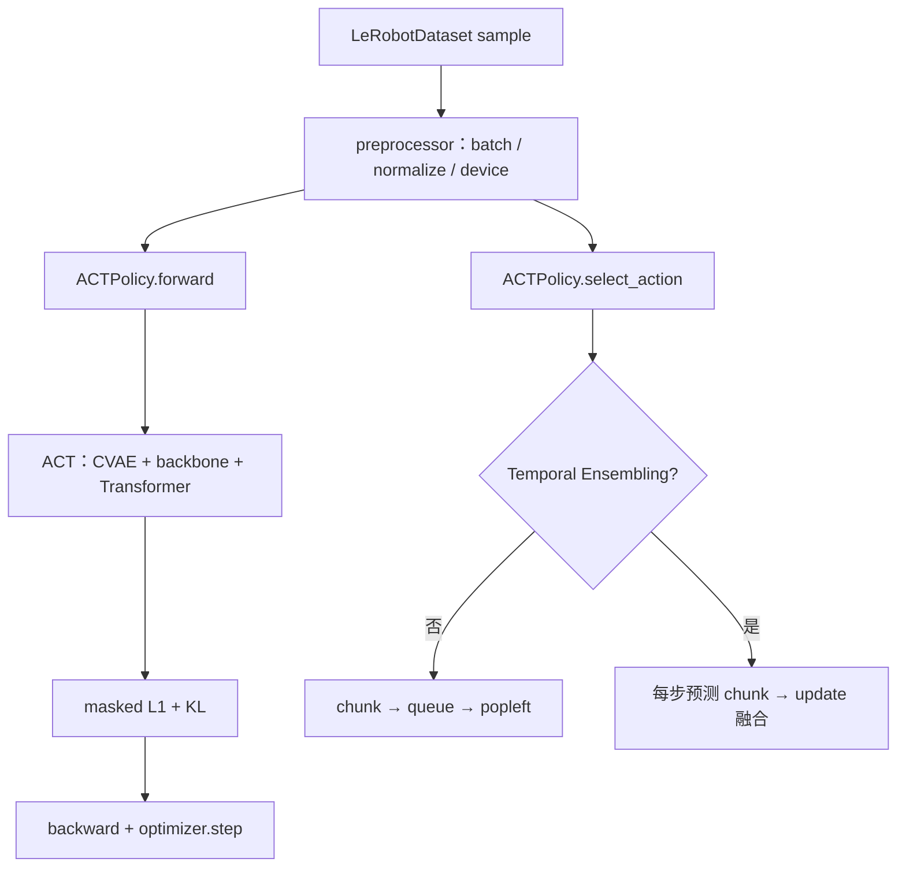

# In-depth Analysis of Source Code

最开始我把“ACT 已经复现”理解成：训练命令能跑、checkpoint 能加载、SO-101 能动起来。继续追到 `select_action()` 后，我才发现模型吐出一整段动作，只完成了“后厨备菜”；这段动作怎样被截取、放进 queue、逐帧取出，或者被 Temporal Ensembling 重新融合，才决定机器人这一帧真正吃到什么。🤖

这个分支把我在 `Grab the glue` 任务之后继续核对的 ACT 源码整理成可复查的阅读笔记。重点不是把 `modeling_act.py` 翻译一遍，而是从 Dataset、processor、训练与推理一路追到真机反馈：既拆开普通 action queue 和 Temporal Ensembling，也把“数据怎样进入模型”与“失败怎样指导下一轮采集”接成完整闭环。每个判断都尽量落回实际类、函数、张量、配置字段或真实实验边界。

[返回 `main` 项目导航](https://github.com/Zeil6/lerobot-so101-imitation-learning/tree/main)

## 源码核对基线

检查日期：**2026-07-23**。

| 来源 | 固定版本 | 说明 |
| --- | --- | --- |
| Hugging Face LeRobot | [`1427d35ef58ab46651dc7ef78bde81642090c861`](https://github.com/huggingface/lerobot/tree/1427d35ef58ab46651dc7ef78bde81642090c861) | 本次整理使用的源码核对基线 |
| ACT 原始官方代码 | [`742c753c0d4a5d87076c8f69e5628c79a8cc5488`](https://github.com/tonyzhaozh/act/tree/742c753c0d4a5d87076c8f69e5628c79a8cc5488) | 核对原始训练、DETRVAE、temporal aggregation 与部署循环 |
| ACT 论文 | [Learning Fine-Grained Bimanual Manipulation with Low-Cost Hardware](https://arxiv.org/abs/2304.13705) | 核对 action chunking、CVAE 与 temporal ensemble 的原始动机 |

仓库 `algorithm-notes` 分支在 2026-07-16 使用过 LeRobot `3f2179f` 作为检查基线。本次换到 2026-07-21 的上游 commit `1427d35e` 重新核对：`act_training_example.py`、`configuration_act.py` 与 `modeling_act.py` 的 blob SHA 相同；`processor_act.py` 从“显式列出各 processor step”重构为调用 `make_default_pre_post_processors()`，归一化/反归一化职责没有改变，但序列化细节仍可能存在版本差异。两个 SHA 都**不是**我当时训练 checkpoint 对应版本的证明。实验版本仍要从本地环境、`config.json` 或 checkpoint metadata 追溯。

本次增量继续以聊天中上传的 `processor_act.py` 为主要学习对象。它的显式 Step 顺序与固定 commit `3f2179f3b69708b6ad009b2e7685dd9d05269ee1` 的结构和关键参数一致；由于上传文件没有 Git metadata，我只记录“结构核对一致”，不擅自把它认领为该 commit 的同一 blob。

## 训练与推理总览

同一个 `ACT` 神经网络会参与训练和推理，但外围调用方式不同：

- 训练时，`forward()` 需要真实 action chunk 来构造 CVAE latent，并计算监督损失。
- 普通推理时，`predict_action_chunk()` 先生成完整 chunk，`select_action()` 只缓存并返回一个动作。
- Temporal Ensembling 开启时，每个控制时刻都重新预测 chunk，再把多次预测中落到“当前时刻”的动作融合；它不走普通 queue。

## 文档入口

| 笔记 | 核心问题 |
| --- | --- |
| [01 · 训练入口](docs/01_training_entry.md) | `act_training_example.py` 怎样把 Dataset、processor、Policy、loss、optimizer 和保存串起来 |
| [02 · Policy 训练与推理接口](docs/02_policy_inference.md) | `forward()`、`predict_action_chunk()`、`select_action()` 分别负责什么 |
| [03 · action chunk 与 action queue](docs/03_action_chunk_and_queue.md) | “模型预测的一段动作”和“待执行缓存”为什么不是同一回事 |
| [04 · Temporal Ensembling](docs/04_temporal_ensembling.md) | `ACTTemporalEnsembler.update()` 如何在线融合重叠预测 |
| [05 · Transformer 层](docs/05_transformer_layers.md) | `ACTEncoderLayer.forward()` 与 `ACTDecoderLayer.forward()` 的实际数据流 |
| [06 · 原始 ACT 对照](docs/06_original_act_comparison.md) | LeRobot 的通用封装与 ALOHA 原始实现在哪些地方相同、哪些地方不同 |
| [07 · 源码地图](docs/07_source_map.md) | 固定 commit、文件路径、关键符号和完整调用链 |
| [08 · 数据闭环](docs/08_data_closed_loop.md) | 从采集、Dataset、训练和部署回到失败分类与下一轮定向补采，区分已完成实验与计划 |
| [09 · `preprocessor(batch)`](docs/09_preprocessor_batch.md) | 沿真实 factory 与 Processor Step 拆开字段、batch 维、device、normalization 和 postprocessor |

## 推荐阅读顺序

1. 从[训练入口](docs/01_training_entry.md)认清 Dataset、DataLoader 和一次参数更新。
2. 沿着 batch 进入[`preprocessor(batch)`](docs/09_preprocessor_batch.md)，看它怎样经过 Rename、Batch、Device 与 Normalize，再交给 `ACTPolicy.forward()`。
3. 接着读[Policy 训练与推理接口](docs/02_policy_inference.md)，把 `forward()`、`predict_action_chunk()` 和 `select_action()` 分家。
4. 用[action chunk 与 queue](docs/03_action_chunk_and_queue.md)和[Temporal Ensembling](docs/04_temporal_ensembling.md)理解两条部署路径。
5. 再进入[Transformer 层](docs/05_transformer_layers.md)与[原始实现对照](docs/06_original_act_comparison.md)，把模型内部和工程封装对上。
6. 回到[数据闭环](docs/08_data_closed_loop.md)：从真机失败判断数据覆盖，并把定向补采明确写成下一轮计划。
7. 需要核对文件、类名或版本时，使用[源码地图](docs/07_source_map.md)回到固定 commit。

## 已确认的结论

- `ACTPolicy.forward()` 返回 `(loss, loss_dict)`，不是动作；真正的动作预测在底层 `ACT.forward()` 中产生，再被用于计算 masked L1 与 KL。
- `predict_action_chunk()` 返回完整的 `[B, chunk_size, A]` 动作序列，但当前源码没有在该函数内反归一化，也不会直接给机器人下指令。
- 普通 `select_action()` 只在 queue 为空时调用模型，截取前 `n_action_steps`，随后每次 `popleft()` 一个 `[B, A]` 动作。
- `chunk_size` 是模型预测长度；`n_action_steps` 是普通 queue 模式一次实际保留的长度。后半段可以被丢弃。
- `temporal_ensemble_coeff` 默认是 `None`，即 Temporal Ensembling 默认关闭；开启时要求 `n_action_steps=1`。
- 当前实现中，正的 Temporal Ensembling 系数给**旧预测**更高权重，负值才偏重新预测。
- `ACTDecoderLayer` 的 self-attention 让动作查询彼此交流，cross-attention 再读取图像、robot state 与 latent 组成的 encoder memory。
- LeRobot 默认 `n_decoder_layers=1`，是为了匹配原始代码“虽然构造 7 层，但 action head 最终取 decoder stack 的第 0 层输出”的实际行为。

## 仍需核对的问题

- 我的 ACT checkpoint 对应的精确 LeRobot tag/commit、`chunk_size`、`n_action_steps` 与 `temporal_ensemble_coeff` 保存值。
- SO-101 数据集当时保存的 state/action 维度与全部 feature 名称；本文对 `S`、`A` 使用符号表达，典型 6 维只作为待元数据确认的例子。
- 训练命令实际走的 processor 版本是否与本次基线完全一致。
- Temporal Ensembling 在 `Grab the glue` 任务中的独立贡献；我尚未做开关消融，不能用现有视频代替这个实验。
- 不同 `n_action_steps` 对闭环纠偏、推理频率和真机连续性的量化影响。

> ⚠️ 这里记录的是“本次整理进一步核对到的源码事实”。我没有修改 LeRobot 的 ACT 模型源码，也没有把后来读到的新版本实现倒推成旧 checkpoint 已经使用的行为。
