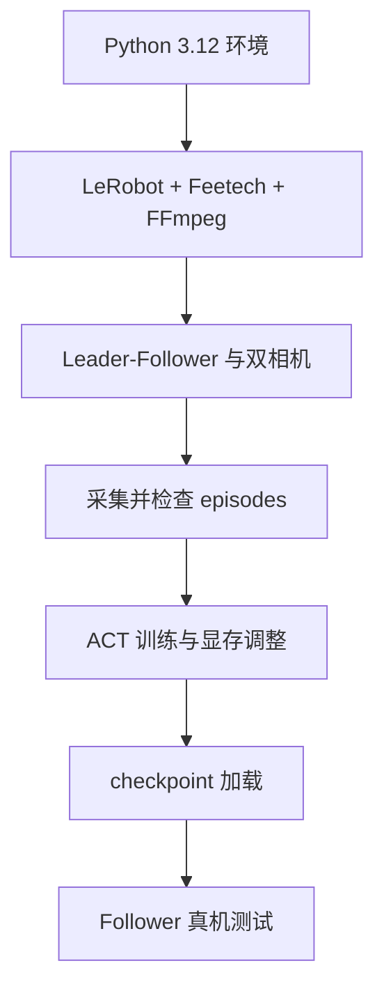

# ACT 复刻：从 SO-101 示范采集到真机部署

本分支记录我使用 SO-101 Leader–Follower、两路 OpenCV 相机和 LeRobot 复刻 ACT 的完整过程。基本的数据采集、训练、checkpoint 加载和 Follower 真机测试已经走通；系统性成功率、多 checkpoint 对比和分布外恢复能力仍未完成，因此这里不填写未经统计的指标。

[返回 `main` 项目导航](https://github.com/Zeil6/lerobot-so101-imitation-learning/tree/main)

## 我实际做过的工作

- 建立 Python 3.12 Conda 环境并以 editable 方式安装 LeRobot。
- 安装 Feetech 支持和 FFmpeg，连接 SO-101 Leader、Follower 与双摄像头。
- 为 `Grab the glue` 任务采集 episode，并处理提前退出导致的空 episode 问题。
- 使用 RTX 5060 Ti 16GB 训练 ACT，依据 OOM 日志降低 batch size。
- 加载 checkpoint 自动控制 Follower，部署时移除 Leader teleop 配置。
- 检查训练数据与部署端的相机名称和数量是否一致。

## 环境与设备

| 类别 | 当前记录 |
| --- | --- |
| 系统 | Ubuntu |
| 环境管理 | Conda |
| Python | 3.12 |
| 机器人 | SO-101 Leader / Follower，Feetech 舵机 |
| 相机 | `handeye`、`fixed` 两路 OpenCV 相机 |
| 图像采集配置 | 1280×720，30 FPS |
| 任务 | `Grab the glue` |
| GPU | RTX 5060 Ti 16GB |

LeRobot 的命令入口和参数会随版本变化。这里优先记录我当时实际使用的命令形态；复现前先运行 `lerobot-record --help` 和 `lerobot-train --help`，以本地安装版本为准。

## 文档导航

- [`docs/workflow.md`](docs/workflow.md)：环境、数据采集、训练和部署命令。
- [`docs/troubleshooting.md`](docs/troubleshooting.md)：真实问题、错误判断、日志证据和验证方法。
- [`docs/algorithm-and-review.md`](docs/algorithm-and-review.md)：ACT 原理与阶段性反思。

## 流程概览

## 阶段性结论

- ACT 的基本真机模仿学习链路已经跑通。
- 动作分块让策略不必每个控制周期只预测一个动作；部署时还需要保证观测定义和训练一致。
- CUDA OOM 不能只看显卡总容量，应看报错发生时的空闲显存、当前 batch size、双相机输入和显存碎片。
- 单次抓取成功不构成稳定性结论。

## 尚未完成

- 固定条件下的重复测试和准确成功率统计。
- 多 checkpoint 的系统性对比，而不是只测试 `last`。
- 初始位置变化、遮挡和中途偏差后的恢复能力评估。
- 将实际最终 batch size、训练步数和 checkpoint 名称从原始实验日志补回仓库。

