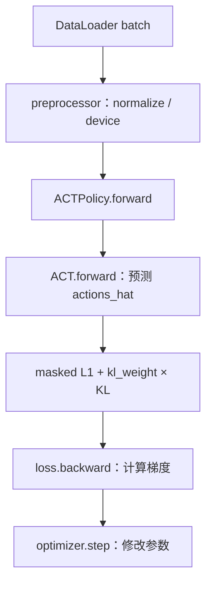

# 01 · 从 `act_training_example.py` 看一次训练更新

[返回分支入口](../README.md) · [下一篇：Policy 训练与推理接口](02_policy_inference.md)

源码位置：[`examples/tutorial/act/act_training_example.py`](https://github.com/huggingface/lerobot/blob/1427d35ef58ab46651dc7ef78bde81642090c861/examples/tutorial/act/act_training_example.py)。这个文件在本次 LeRobot 基线中真实存在，不是我根据训练命令拼出的伪代码。

## 它解决的不是“训出最好模型”，而是把链路接通

这个示例只设置 `training_steps = 1`。所以它更像 ACT 的最小可运行解剖图：

```text
dataset metadata
→ ACTConfig / ACTPolicy
→ preprocessor / postprocessor
→ LeRobotDataset + delta_timestamps
→ DataLoader
→ policy.forward(batch)
→ backward()
→ optimizer.step()
→ save_pretrained()
```

它能回答“每个对象怎样接到下一个对象”，不能单独回答需要多少 episode、训练多少步或哪一个 checkpoint 真机最好。对我的 SO-101 抓胶水任务也是一样：一次更新只能证明数据和网络能对上，不能证明机械臂已经学会稳定抓取。

## Dataset 怎样提供 observation 和 action

示例先用 `LeRobotDatasetMetadata(dataset_id)` 读取 feature、统计量与 FPS，再通过 `dataset_to_policy_features()` 把数据集字段变成 Policy 能理解的 `PolicyFeature`。

- `input_features`：图像、`observation.state` 等观测字段。
- `output_features`：类型为 `FeatureType.ACTION` 的动作字段。
- `dataset_metadata.stats`：processor 做归一化/反归一化所需的统计量。
- `dataset_metadata.fps`：把离散索引换成 `delta_timestamps` 的时间单位。

`ACTConfig.action_delta_indices` 返回 `range(chunk_size)`。假设 `chunk_size=100`、数据为 30 FPS，Dataset 会为时刻 `t` 取出 `t` 到 `t+99` 的动作目标；换成相对时间就是 `0/30, 1/30, ..., 99/30` 秒。episode 尾部凑不满时会补齐，并用 `action_is_pad` 标出哪些位置是假填充。

在 `Grab the glue` 里可以这样理解：

- observation：此刻两路相机看见什么，SO-101 关节处于什么状态；
- action chunk：示范者接下来一段时间怎样让机械臂靠近、对准、闭合夹爪；
- `action_is_pad`：这一段是否碰到 episode 结尾，哪些“未来动作”其实不存在。

## batch 中主要字段与 shape

下面使用符号而不是把维度写死：

| 字段 | 典型 shape | 含义 |
| --- | --- | --- |
| `observation.images.<camera>` | `[B, 3, H, W]` | 每个相机一批 RGB 图像；当前 Policy 会把多个相机整理成 Python list |
| `observation.state` | `[B, S]` | 机器人当前状态，`S` 是 state 维度 |
| `action` | `[B, C, A]` | 真实动作序列，`C=chunk_size`，`A` 是 action 维度 |
| `action_is_pad` | `[B, C]` | `True` 表示这个时间位置是 padding |

`B` 是 batch size，`C` 是动作块长度。SO-101 常见配置中 `S`、`A` 可能都是 6，但我的历史数据元信息尚未放进这个分支，所以本文不把“6”冒充成 checkpoint 事实。

## Config、Policy 和 processor 怎样创建

示例的关键四行是：

```python
cfg = ACTConfig(input_features=input_features, output_features=output_features)
policy = ACTPolicy(cfg)
preprocessor, postprocessor = make_pre_post_processors(
    cfg, dataset_stats=dataset_metadata.stats
)
```

`ACTConfig` 决定 feature schema、`chunk_size`、网络宽度、层数、VAE 和推理策略；`ACTPolicy` 再据此创建底层 `ACT` 网络。processor 在 Policy 外面：

- preprocessor 负责归一化、补 batch 维、放到设备等输入处理；
- postprocessor 负责动作反归一化与移回 CPU；
- 训练循环只调用 preprocessor，因为 loss 在归一化空间内计算；postprocessor 被保存下来，留给部署端把模型输出还原到机器人动作尺度。

这修正了我一开始容易产生的错觉：不是 `modeling_act.py` 里的每个推理函数都会自己处理归一化。当前工程把这层职责放在 processor pipeline。

## optimizer 到底更新什么

示例写的是：

```python
optimizer = cfg.get_optimizer_preset().build(policy.parameters())
```

因此 optimizer 收到的是 `policy.parameters()` 中所有 `requires_grad=True` 的参数，包括图像 backbone、CVAE encoder、主 Transformer encoder/decoder、位置/query embedding 与 action head。`loss.backward()` 只计算梯度；真正把参数按 AdamW 规则改掉的是 `optimizer.step()`。

这里还有一个容易漏掉的工程细节：`ACTPolicy.get_optim_params()` 能把 backbone 单独分组并使用 `optimizer_lr_backbone`，但这个最小示例没有调用它，而是直接传 `policy.parameters()`。也就是说，不能只看到 config 里有 `optimizer_lr_backbone`，就断言此示例已经应用了 backbone 独立学习率。

## 一批数据怎样变成一次参数更新



逐步对回代码：

1. `for batch in dataloader` 取一批随机样本。
2. `batch = preprocessor(batch)` 把原始 feature 变成 Policy 预期的数值尺度与设备。
3. `loss, _ = policy.forward(batch)` 调用 ACT 网络并计算总 loss。
4. `loss.backward()` 从总 loss 沿计算图向后计算每个可训练参数的梯度。
5. `optimizer.step()` 根据梯度更新权重。
6. `optimizer.zero_grad()` 清掉本轮梯度，避免下一轮无意累加。

对抓胶水任务来说，L1 在问：“模型预测的未来关节目标，与示范者真实执行的动作片段差多少？”KL 在问：“由真实动作编码出的 latent 分布，是否被约束在推理时可使用的先验附近？”

## 为什么训练时要把真实 actions 送进模型

当前默认 `use_vae=True`。训练时，底层 `ACT.forward()` 会把 `[CLS]`、robot state 和真实 action chunk 组成 VAE encoder 输入，由 class token 输出 `mu` 与 `log_sigma_x2`，再通过重参数化采样 latent：

```text
真实 action chunk + robot state
→ VAE encoder
→ μ, log(σ²)
→ latent z
→ 主 Transformer 预测 action chunk
```

真实 actions 在这里有双重身份：

- 它是模型要重建的监督目标；
- 它也帮助训练期的 latent encoder 描述“这段示范属于怎样的动作风格/模式”。

推理时机器人当然拿不到“未来正确答案”。代码因此不再运行 VAE encoder，而是把 latent 设成全零。这里不是“忘了给 actions”，而是 CVAE 的训练/推理设计本来就不同。

## padding mask 怎样参与模型与 loss

`action_is_pad` 参加两处计算：

1. 在 VAE encoder 中，它作为 `key_padding_mask` 的一部分，防止补齐动作被当成有效 token 编码进 latent。
2. 在 `ACTPolicy.forward()` 中，`valid_mask = ~action_is_pad.unsqueeze(-1)`；L1 只对有效时间位置求和，再除以有效位置数乘 action 维度。

如果不屏蔽，episode 尾部补的零动作会像真实示范一样参与训练，模型会被迫学习并不存在的“收尾动作”。

## `forward()` 返回什么，保存又保存什么

`policy.forward(batch)` 返回：

```text
(loss, loss_dict)
```

- `loss` 是仍连接计算图的 Tensor，用于 `backward()`；
- `loss_dict` 是便于日志记录的 Python 数值，包含 `l1_loss`，启用 VAE 时还有 `kld_loss`。

训练后示例分别执行：

```python
policy.save_pretrained(output_directory)
preprocessor.save_pretrained(output_directory)
postprocessor.save_pretrained(output_directory)
```

在本次基线中，Policy 保存 `config.json` 与 `model.safetensors`；processor 另外保存自己的 pipeline 配置与归一化统计。示例随后还展示 `push_to_hub()`，但那是可选发布动作，不是本地训练必须步骤。

## loss 下降为什么不等于真机一定稳定

离线 loss 只测量“数据集分布内，预测与示范有多接近”。真机稳定性还受这些环节影响：

- 相机位置、裁剪和曝光是否与训练一致；
- `n_action_steps` 是否让机器人开环执行太久；
- 控制循环、串口通信和模型推理是否及时；
- 当前状态是否已经偏出 10-episode 示范覆盖范围；
- action 反归一化和 feature schema 是否与 checkpoint 匹配。

所以 loss 是体检报告中的一个指标，不是“抓胶水许可证”。

## 证据表

| 我的理解 | LeRobot 源码证据 | ACT 论文/官方代码 | SO-101 实验对应 |
| --- | --- | --- | --- |
| Dataset 要给出未来 action chunk | [`act_training_example.py`](https://github.com/huggingface/lerobot/blob/1427d35ef58ab46651dc7ef78bde81642090c861/examples/tutorial/act/act_training_example.py#L47-L64) 使用 `action_delta_indices` | 原始 [`utils.py`](https://github.com/tonyzhaozh/act/blob/742c753c0d4a5d87076c8f69e5628c79a8cc5488/utils.py#L12-L70) 从当前时刻取后续动作并 padding | 数据来自 `Grab the glue` 示范 episode；确切 feature 元数据待补 |
| 真实 actions 同时用于 latent 与监督 | [`ACT.forward()`](https://github.com/huggingface/lerobot/blob/1427d35ef58ab46651dc7ef78bde81642090c861/src/lerobot/policies/act/modeling_act.py#L367-L460) 与 [`ACTPolicy.forward()`](https://github.com/huggingface/lerobot/blob/1427d35ef58ab46651dc7ef78bde81642090c861/src/lerobot/policies/act/modeling_act.py#L123-L153) | 原始 [`DETRVAE.forward()`](https://github.com/tonyzhaozh/act/blob/742c753c0d4a5d87076c8f69e5628c79a8cc5488/detr/models/detr_vae.py#L63-L133) | 本次整理进一步核对；不是我修改过模型 |
| optimizer.step 才修改权重 | [示例训练循环](https://github.com/huggingface/lerobot/blob/1427d35ef58ab46651dc7ef78bde81642090c861/examples/tutorial/act/act_training_example.py#L73-L95) | 原始 [`train_bc()`](https://github.com/tonyzhaozh/act/blob/742c753c0d4a5d87076c8f69e5628c79a8cc5488/imitate_episodes.py#L302-L359) | 我实际走通过 ACT 训练，但没有在此伪造训练步数或 loss 曲线 |
| 保存必须包括动作尺度信息 | [`processor_act.py`](https://github.com/huggingface/lerobot/blob/1427d35ef58ab46651dc7ef78bde81642090c861/src/lerobot/policies/act/processor_act.py) 与示例保存逻辑 | 原始实现另存 `dataset_stats.pkl` | 部署时相机/统计/配置需与训练一致；精确 checkpoint 内容仍需本地核对 |
