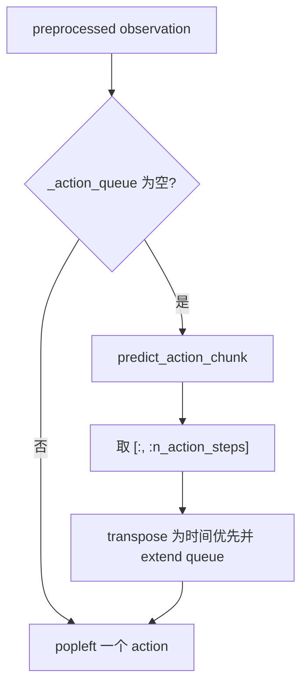

# 02 · `forward()`、`predict_action_chunk()` 与 `select_action()`

[上一篇：训练入口](01_training_entry.md) · [返回分支入口](../README.md) · [下一篇：action chunk 与 queue](03_action_chunk_and_queue.md)

这三个函数挨得很近，第一次看时很容易把它们理解成“都是让 ACT 往前跑一下”。实际职责差得很大：

```text
forward()               训练/验证：预测并算 loss
predict_action_chunk()  推理：做一批动作计划
select_action()         控制循环：决定当前这一帧返回哪个动作
```

关键代码都在 [`src/lerobot/policies/act/modeling_act.py`](https://github.com/huggingface/lerobot/blob/1427d35ef58ab46651dc7ef78bde81642090c861/src/lerobot/policies/act/modeling_act.py)。

## 调用前：normalization 在哪里

当前 LeRobot 把 normalization 放在 Policy 外部的 processor pipeline。部署端应先用 preprocessor 处理 observation，再调用 `select_action()`；得到动作后，再交给 postprocessor 反归一化、移回 CPU。

因此以下三个函数接收/输出的都是**模型空间**数据：

- `ACTPolicy` 内部只把多相机字段整理为 `OBS_IMAGES` list；
- `predict_action_chunk()` 不调用 postprocessor；
- `select_action()` 返回的 action 仍需要由外部 postprocessor 还原成机器人动作尺度。

> 🧠 我最初的理解：模型预测完，函数返回的应该就是机器人能直接执行的动作。
>
> 🔍 继续追代码后发现：Policy 与 processor 是两层。模型负责预测，postprocessor 才负责把归一化动作还原。

## `ACTPolicy.forward()`：训练时预测并计算 loss

### 需要哪些 batch 字段

| 条件 | batch 字段 | shape |
| --- | --- | --- |
| 有图像输入 | 每个 `config.image_features` 对应的 key | 每项 `[B, 3, H, W]` |
| 有 robot state | `observation.state` | `[B, S]` |
| 有 environment state | 对应 ENV feature | `[B, E]` |
| 训练/验证 loss | `action` | `[B, C, A]` |
| 训练/验证 loss | `action_is_pad` | `[B, C]` |

`B` 是 batch size，`C=chunk_size`，`A` 是动作维度。

### 按真实顺序拆开

1. 如果配置包含图像，浅复制 `batch`。
2. 按 `config.image_features` 的顺序收集多相机张量，放到 `batch[OBS_IMAGES]` list。
3. 调用 `self.model(batch)`，即底层 `ACT.forward()`。
4. 得到 `actions_hat: [B,C,A]` 和 latent 参数 `(mu_hat, log_sigma_x2_hat)`。
5. 计算逐元素 L1：`abs_err = |action - actions_hat|`。
6. 用 `~action_is_pad` 建立有效位置 mask。
7. 只对有效动作元素求平均，得到 `l1_loss`。
8. `use_vae=True` 时计算 KL，并组合 `loss = l1_loss + kl_weight * mean_kld`。
9. 返回 `(loss, loss_dict)`。

当前实现计算 L1 时除以“有效时间位置数 × action 维度”，不会让 padding 数量改变损失分母。这一点和原始 ACT `masked_error.mean()` 的具体缩放并不完全相同，详见[原始实现对照](06_original_act_comparison.md)。

### 哪些参数会更新

`forward()` 自己不更新参数。训练循环调用 `loss.backward()` 后，梯度会流向参与本次预测的可训练参数：

- ResNet backbone 与图像投影；
- VAE encoder、latent 投影；
- 主 Transformer encoder/decoder；
- robot/environment state 投影；
- positional/query embeddings；
- action head。

随后 `optimizer.step()` 才真正修改权重。普通 queue、`deque` 与 Temporal Ensembler 都没有可训练参数，不参与反向传播。

## 底层 `ACT.forward()` 的训练与推理分叉

| 阶段 | 输入 | 是否使用真实 actions | latent 来源 | 输出 |
| --- | --- | --- | --- | --- |
| 训练 | 归一化图像、state、真实 action chunk、padding mask | 是 | VAE encoder 输出 `mu/log_sigma_x2`，重参数采样 | `actions_hat [B,C,A]`、`mu`、`log_sigma_x2`，由 Policy 继续算 loss |
| 推理 | 当前归一化图像、state | 否 | 全零 `[B, latent_dim]` | 完整动作预测 `actions [B,C,A]`，latent 参数为 `None` |

训练时真实 actions 不是拿来“偷偷告诉模型答案”后直接复制。它们进入额外的 VAE encoder，帮助模型学习动作序列潜变量，同时仍作为重建目标。推理时没有未来真值，所以跳过这条支路。

## `predict_action_chunk()`：一次生成整段计划

真实代码只有几步，但信息量不小：

```python
self.eval()
batch[OBS_IMAGES] = [batch[key] for key in self.config.image_features]
actions = self.model(batch)[0]
return actions
```

### 它为什么一次预测一整段

ACT 的 `decoder_pos_embed` 有 `chunk_size` 个 learnable query position。Decoder 会同时为这些位置生成隐藏表示，action head 再映射成 `[B,C,A]`。这就是 action chunking：不是循环调用单步网络 100 次，而是一次前向得到 100 个动作位置（若 `C=100`）。

### 它返回完整 chunk 还是裁剪区间

当前实现返回底层模型的完整 `[B, chunk_size, A]`，没有按 `n_action_steps` 截断。截断发生在普通 `select_action()`：

```python
actions = self.predict_action_chunk(batch)[:, : self.config.n_action_steps]
```

Temporal Ensembling 则会拿完整 chunk 去 `update()`。

### 它有没有直接控制机器人

没有。它没有调用机器人驱动、没有串口写入、没有 `env.step()`，也没有外部 postprocessor。它只是一次模型推理 API。把它理解成“后厨做好一整盘”，更准确的代码说法是：返回模型空间的 batch action tensor，后续消费方式由 `select_action()` 决定。

## 普通 `select_action()`：queue 只剩空位时才叫模型

Temporal Ensembling 关闭时，执行顺序是：



逐行解释：

1. `self.eval()` 关闭 dropout 等训练行为。
2. 检查 `_action_queue` 长度。
3. queue 空时才调用 `predict_action_chunk()`。
4. 从完整 chunk 取前 `n_action_steps`。
5. `actions.transpose(0, 1)` 把 `[B,N,A]` 变成 `[N,B,A]`。
6. `deque.extend()` 按时间步保存 N 个 `[B,A]` tensor。
7. 无论刚填入还是原本就有，最后都 `popleft()` 一项返回。

假设 `n_action_steps=20`，第 1 次调用会推理并返回第 0 个动作；后面 19 次调用只从 queue 取动作。第 21 次调用发现 queue 又空了，才根据新 observation 重新推理。

`reset()` 必须在 episode 切换时调用。否则上一轮抓胶水没执行完的动作可能被带到下一轮——机器人刚重置，Policy 却还在完成上一份待办清单。

## Temporal Ensembling 开启后的 `select_action()`

配置 `temporal_ensemble_coeff is not None` 时，代码在 queue 判断之前直接进入另一条分支：

```text
current observation
→ predict_action_chunk()          每个控制步都运行模型
→ temporal_ensembler.update()     融合对当前时刻的重叠预测
→ return one action
```

没有 `_action_queue.extend()`，也没有 `popleft()`。为保证每个控制步都能形成新旧重叠预测，`ACTConfig` 要求此时 `n_action_steps=1`。

## `forward()` 与两个推理函数的根本差别

| 函数 | 面向阶段 | 真实 action | 输出 | 是否管理缓存 | 是否直接反归一化 |
| --- | --- | --- | --- | --- | --- |
| `forward()` | 训练/验证 | 必须有，用于 latent 与 loss | `(loss, loss_dict)` | 否 | 否 |
| `predict_action_chunk()` | 推理 | 没有 | 完整 `[B,C,A]` | 否 | 否 |
| `select_action()` | 控制循环 | 没有 | 单步 `[B,A]` | queue 或 ensembler | 否 |

Transformer 好不容易算出一整盘动作，普通模式的 `popleft()` 每次只端走一小碟。🍽️ 但这只是部署缓存策略，不是第二个神经网络。

## 证据表

| 我的理解 | LeRobot 源码证据 | ACT 论文/官方代码 | SO-101 实验对应 |
| --- | --- | --- | --- |
| 三个函数职责不同 | [`ACTPolicy`](https://github.com/huggingface/lerobot/blob/1427d35ef58ab46651dc7ef78bde81642090c861/src/lerobot/policies/act/modeling_act.py#L37-L154) | 原始 [`policy.py`](https://github.com/tonyzhaozh/act/blob/742c753c0d4a5d87076c8f69e5628c79a8cc5488/policy.py#L8-L38) 把训练 loss 与无 actions 推理解开 | 我实际调用的是部署命令；本次整理进一步追到 Policy API |
| `predict_action_chunk()` 不反归一化 | 函数只调用 `self.model(batch)[0]`；[`processor_act.py`](https://github.com/huggingface/lerobot/blob/1427d35ef58ab46651dc7ef78bde81642090c861/src/lerobot/policies/act/processor_act.py) 说明 postprocessor 负责 unnormalization | 原始评估循环在 Policy 外用 `post_process` | 部署统计必须与 checkpoint 匹配；当时 processor 版本待核对 |
| Temporal Ensembling 不走 queue | [`select_action()`](https://github.com/huggingface/lerobot/blob/1427d35ef58ab46651dc7ef78bde81642090c861/src/lerobot/policies/act/modeling_act.py#L86-L122) 的提前返回分支 | 原始 `imitate_episodes.py` 开启 `temporal_agg` 后把 query frequency 设为 1 | 尚未证明我的 checkpoint 开启；不把视频连续性归因于此 |
