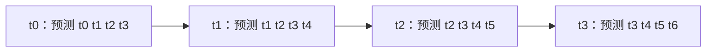

# 04 · `ACTTemporalEnsembler.update()`：重叠预测怎样落到当前动作

[上一篇：chunk 与 queue](03_action_chunk_and_queue.md) · [返回分支入口](../README.md) · [下一篇：Transformer 层](05_transformer_layers.md)

Temporal Ensembling 不是“给一条动作曲线撒点平均值”。它处理的是：在不同控制时刻，模型会对同一个未来绝对时刻给出多份预测，该相信哪一份、怎样在线融合。⏳

源码位置：[`ACTTemporalEnsembler`](https://github.com/huggingface/lerobot/blob/1427d35ef58ab46651dc7ef78bde81642090c861/src/lerobot/policies/act/modeling_act.py#L157-L258)。

## 为什么会出现重叠预测

假设每次预测 4 步：



绝对时刻 `t2` 同时得到三份候选：

- 在 `t0` 看到环境时，对两步后的预测；
- 在 `t1` 看到环境时，对一步后的预测；
- 在 `t2` 看到环境时，对当前动作的预测。

Temporal Ensembling 每个控制步都生成新 chunk，因此才有这些重叠。普通 queue 在消费缓存时不重新推理，不会自然产生同样的重叠集合。

## 配置入口与默认状态

当前 `ACTConfig` 的字段是：

```python
temporal_ensemble_coeff: float | None = None
```

- `None`：默认关闭，走普通 action queue；
- 非 `None`：创建 `ACTTemporalEnsembler`；
- 开启时要求 `n_action_steps=1`，否则 `__post_init__()` 抛出 `NotImplementedError`。

这个约束不是说 chunk 变成 1。`chunk_size` 仍可为 100；`n_action_steps=1` 表示每个控制步必须重新查询模型，才能不断获得新的重叠 chunk。

## 权重方向：当前源码偏向旧预测

构造函数计算：

```text
w_i = exp(-m × i)
```

其中 `m = temporal_ensemble_coeff`，`i=0` 对应参与当前融合的最旧预测。

| 系数 | 权重关系 | 当前源码含义 |
| --- | --- | --- |
| `m = 0` | 全部相等 | 简单平均 |
| `m > 0` | `w0 > w1 > w2...` | 旧预测权重更高 |
| `m < 0` | `w0 < w1 < w2...` | 新预测权重更高 |

原始 ACT 使用 `k=0.01`，LeRobot 的 config 注释也把 `0.01` 标成原始值。因此在当前实现里，正的默认参考系数不是“越新越可信”，而是轻微偏向更早、看得更远的那份计划。

> 🧠 我最初的理解：指数衰减通常意味着旧数据越旧权重越小。
>
> 🔍 继续追索引后发现：这里 `i=0` 被定义成最旧预测，所以正系数反而让旧预测权重大。不能只看公式名字，要看数组顺序。

## `update()` 的输入与输出

```text
输入 actions: [B, C, A]
输出 action:  [B, A]
```

- `B`：batch size；
- `C=chunk_size`；
- `A`：action 维度。

内部保存：

- `ensembled_actions`：对未来尚未消费时刻的在线平均，shape 最多 `[B,C,A]`；
- `ensembled_actions_count`：每个未来位置已经融合了多少份预测，shape `[remaining_C,1]`；
- `ensemble_weights` 与 cumulative sum：长度为 `C`。

## 第一次 update 做什么

第一次没有历史：

1. `ensembled_actions = actions.clone()`；
2. 每个位置的 count 初始化为 1；
3. 取出 `ensembled_actions[:,0]` 作为当前动作；
4. 删除第一个位置，剩下的序列整体向当前时刻靠近一格。

所以第一次没有“融合”，因为每个未来时刻只有一份预测。

## 后续 update 怎样对齐时间

第二次进入时，旧缓存已经去掉上一帧动作，长度为 `C-1`。新 chunk 的前 `C-1` 项与这段缓存指向同一组绝对未来时刻：

```text
旧缓存：上一次预测的 [t1, t2, ..., t(C-1)]
新 chunk：这一次预测的 [t1, t2, ..., tC]
```

因此代码用 `actions[:, :-1]` 更新旧缓存，再把新 chunk 的最后一项 `actions[:, -1:]` 接到尾部。每个位置都使用累计权重做在线加权平均，不需要保存所有历史 chunk。

计算结构可以读成：

```text
旧平均 × 旧权重总和
+ 新预测 × 本次对应权重
÷ 新权重总和
```

最后仍然消费第一个位置，只返回当前 `[B,A]` 动作。

## 一个 3 步、1 维动作的数值例子

> 这是为了看懂算法的**假设示例**，不是 SO-101 的真实动作值。设 `chunk_size=3`，`m=0.5`。

权重为：

```text
w0 = 1.0000
w1 = 0.6065
w2 = 0.3679
```

模型连续三次预测：

| 推理时刻 | 新 chunk | 当前时刻有哪些候选 | 融合后输出 |
| --- | --- | --- | --- |
| `t0` | `[1, 2, 3]` | `1` | `1.00` |
| `t1` | `[10, 20, 30]` | 旧预测 `2`、新预测 `10` | `(1×2 + 0.6065×10) / 1.6065 = 5.02` |
| `t2` | `[100, 200, 300]` | `t0` 预测 `3`、`t1` 预测 `20`、`t2` 预测 `100` | `(1×3 + 0.6065×20 + 0.3679×100) / 1.9744 = 26.30` |

从结果能看出：它不是简单取最新的 `100`，也不是对 `3、20、100` 等权平均。正系数让更早的 `3` 权重最高。

## 内部张量怎样移动

以长度 3 为例：

```text
t0 update 后缓存： [avg(t1), avg(t2)]
t1 拼接新尾部后：  [avg(t1), avg(t2), pred(t3)]
t1 消费后缓存：    [avg(t2), pred(t3)]
t2 再与新 chunk 的前两项对齐更新
```

实现没有建立 `[episode_len, episode_len+C, A]` 的巨大历史表，而是只保留“从当前开始还没消费的未来”。这与原始 ACT 评估循环的离线式 `all_time_actions` 存储位置不同，但目标相同。

## reset、时间复杂度与显存

`reset()` 把 `ensembled_actions` 和 count 设为 `None`。每个新 episode 都必须调用，否则新一轮会把旧一轮未来动作当成同一时间轴上的历史预测。

对每次 `update()`：

- 时间复杂度约为 `O(B × C × A)`；
- 在线状态显存约为 `O(B × C × A)`；
- `C` 变长时，融合计算和缓存近似线性增长；
- 更大的实际开销通常仍是“每个控制步都要运行 backbone + Transformer”，而不是这几次逐元素加减。

## 普通 queue 与 Temporal Ensembling 对比

| 维度 | 普通 action queue | Temporal Ensembling |
| --- | --- | --- |
| 模型推理频率 | queue 耗尽时；约每 `n_action_steps` 步一次 | 每个控制步一次 |
| 当前动作来源 | 最近一个 chunk 中尚未消费的单项 | 多个推理时刻对当前绝对时刻的加权结果 |
| 是否融合重叠预测 | 否 | 是 |
| 闭环程度 | 由 `n_action_steps` 决定 | 每步使用新 observation，闭环更频繁 |
| 计算开销 | 较低，可复用缓存动作 | 较高，每步都运行模型并更新在线平均 |
| 主要风险 | 开环段过长时纠偏慢；chunk 边界可能跳变 | 推理赶不上控制周期；权重方向/系数不合适会压制新观测 |

Temporal Ensembling 可能帮助动作衔接，但不能把 ACT 视频的连续性全部归给它。我的部署配置是否开启仍需读取 checkpoint 配置；而当前默认值明确是关闭。

## 证据表

| 我的理解 | LeRobot 源码证据 | ACT 论文/官方代码 | SO-101 实验对应 |
| --- | --- | --- | --- |
| 开启后每步重新推理，不走 queue | [`ACTPolicy.select_action()`](https://github.com/huggingface/lerobot/blob/1427d35ef58ab46651dc7ef78bde81642090c861/src/lerobot/policies/act/modeling_act.py#L86-L122) | 原始 [`eval_bc()`](https://github.com/tonyzhaozh/act/blob/742c753c0d4a5d87076c8f69e5628c79a8cc5488/imitate_episodes.py#L202-L266) 在 `temporal_agg` 时 `query_frequency=1` | 是否在我的 checkpoint 开启仍需核对 |
| 正系数偏旧预测 | [`ACTTemporalEnsembler.__init__`](https://github.com/huggingface/lerobot/blob/1427d35ef58ab46651dc7ef78bde81642090c861/src/lerobot/policies/act/modeling_act.py#L158-L219) 的索引说明 | 原始代码 `exp(-k * arange)` 且历史按推理时刻排序 | 尚未做权重系数消融 |
| 在线实现只保留未来平均 | [`update()`](https://github.com/huggingface/lerobot/blob/1427d35ef58ab46651dc7ef78bde81642090c861/src/lerobot/policies/act/modeling_act.py#L221-L258) | 原始实现保留 `all_time_actions` 后筛当前列 | 这是工程实现差异，不代表我修改过模型 |
