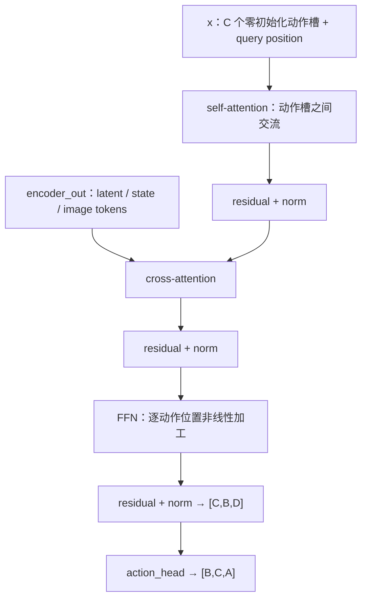

# 05 · `ACTEncoderLayer.forward()` 与 `ACTDecoderLayer.forward()`

[上一篇：Temporal Ensembling](04_temporal_ensembling.md) · [返回分支入口](../README.md) · [下一篇：原始 ACT 对照](06_original_act_comparison.md)

Transformer 的术语很多，但回到 ACT 只需要抓住两件事：

- Encoder 把图像、机器人状态和 latent 组织成可查询的场景表示；
- Decoder 用一组动作 query 去读取这个场景表示，形成每个动作位置的隐藏向量。

## 先认清实际输入

底层 [`ACT.forward()`](https://github.com/huggingface/lerobot/blob/1427d35ef58ab46651dc7ef78bde81642090c861/src/lerobot/policies/act/modeling_act.py#L367-L518) 先创建 Encoder token：

```text
[latent token]
+ [robot state token，可选]
+ [environment state token，可选]
+ [camera 1 feature-map pixels]
+ [camera 2 feature-map pixels]
+ ...
```

每个相机图像先经过 torchvision ResNet，再通过 `1×1 Conv` 投影到 `dim_model`。二维特征图 `[B,D,h,w]` 被展平成 `h×w` 个 token，所有 token 最后堆成：

```text
encoder_in_tokens: [ES, B, D]
```

`ES` 是 Encoder sequence length，`D=dim_model`。

Decoder 输入并不是上一时刻真实动作，而是一块全零张量：

```text
decoder_in: [C, B, D]
```

再通过 `decoder_pos_embed: [C,1,D]` 区分 C 个动作位置。默认 config 中 `C=100`，但我的 checkpoint 具体值仍需核对。

## `ACTEncoderLayer.forward()`

源码：[`ACTEncoderLayer`](https://github.com/huggingface/lerobot/blob/1427d35ef58ab46651dc7ef78bde81642090c861/src/lerobot/policies/act/modeling_act.py#L537-L578)。

### `x/src` 是什么

类里参数名叫 `x`，可以把它理解为 Transformer 常见写法里的 `src`：shape 为 `[ES,B,D]` 的 token 序列。

- 主 Encoder 中，它代表 latent、state 和图像特征；
- VAE Encoder 中，它代表 `[CLS]`、robot state 与真实 action tokens。

### self-attention 解决什么

self-attention 让每个 token 根据其他 token 更新自己。抓胶水时，一个图像区域可能看到夹爪，另一个区域看到胶水；state token 又知道当前关节姿态。attention 让这些来源互相建立关系，而不是各算各的。

当前代码：

```python
q = k = x if pos_embed is None else x + pos_embed
x = self.self_attn(q, k, value=x, key_padding_mask=key_padding_mask)[0]
```

position embedding 加在 query/key 上，帮助 attention 区分“这是谁、来自哪里”；value 仍是原 token 内容。

### position embedding 与 padding mask

- 主 Encoder 的 1D token 使用 learnable position embedding，图像 token 使用 2D sinusoidal position embedding；
- VAE Encoder 使用固定 1D sinusoidal position embedding；
- `key_padding_mask` 主要在 VAE Encoder 中屏蔽 episode 末尾补齐的 action token。

当前 `ACTEncoderLayer.forward()` 没有独立的 `attn_mask` 参数，只有 `key_padding_mask`。主 Encoder 调用时也没有给它 padding mask，因为图像/state token 本身不是通过 action padding 补出来的。

### residual、LayerNorm、FFN 与 dropout

一个 Encoder layer 有两段：

```text
self-attention
→ dropout
→ residual add
→ LayerNorm
→ Linear(D→FF) + activation + dropout + Linear(FF→D)
→ dropout
→ residual add
→ LayerNorm
```

- residual connection：把子层输入直接加回输出，像给信息留一条“高速公路”，减少深层训练时的信息损失；
- LayerNorm：按每个 token 的隐藏维归一化，稳定数值尺度；
- FFN：对每个位置独立做两层非线性变换，先扩到 `dim_feedforward` 再压回 `D`；
- dropout：训练时随机屏蔽部分激活，降低过拟合；`eval()` 时关闭。

### pre-norm 与 post-norm

`pre_norm=True` 时，先 LayerNorm 再进 attention/FFN；`False` 时，先做子层与 residual，再 LayerNorm。当前默认 `pre_norm=False`，即 post-norm。

两条路径的运算顺序不同，但 self-attention 与 FFN 最后都回到 `D` 维，因此输入输出 shape 都保持 `[ES,B,D]`。

## `ACTDecoderLayer.forward()`

源码：[`ACTDecoderLayer`](https://github.com/huggingface/lerobot/blob/1427d35ef58ab46651dc7ef78bde81642090c861/src/lerobot/policies/act/modeling_act.py#L598-L686)。

### `x/tgt` 与 `encoder_out/memory`

| 当前类名 | Transformer 常用名 | shape | 含义 |
| --- | --- | --- | --- |
| `x` | `tgt` | `[C,B,D]` | C 个动作 query 的当前隐藏表示，初始为零 |
| `encoder_out` | `memory` | `[ES,B,D]` | Encoder 编好的图像/state/latent 场景表示 |
| `decoder_pos_embed` | query position | `[C,1,D]` | 区分不同动作位置 |
| `encoder_pos_embed` | memory position | `[ES,1,D]` | 区分 Encoder token 的身份/空间位置 |

### 实际数据流图



这不是标准 Transformer 示意图硬套上去：节点顺序正对应当前 `ACTDecoderLayer.forward()` 和底层 `ACT.forward()` 的调用。

### 1. self-attention：动作 query 先互相交流

代码把 `decoder_pos_embed` 加到 query/key：

```python
q = k = x + decoder_pos_embed
x = self.self_attn(q, k, value=x)[0]
```

所有动作位置可以互相看见，因为当前代码没有 causal mask。第 20 个动作 query 可以参考第 19、21 个等其他位置，共同形成一段动作结构。

### 2. cross-attention：动作 query 去读场景 memory

```python
x = self.multihead_attn(
    query=x + decoder_pos_embed,
    key=encoder_out + encoder_pos_embed,
    value=encoder_out,
)[0]
```

query 来自动作槽，key/value 来自 Encoder。直觉上就是每个动作位置带着自己的“问题编号”，去图像、state 与 latent 的 memory 里查找需要的信息。

### 3. FFN：每个位置继续加工

cross-attention 取回场景信息后，FFN 对每个动作位置独立做：

```text
D → dim_feedforward → activation → D
```

随后 residual、dropout、LayerNorm 收尾，shape 保持 `[C,B,D]`。`ACT.forward()` 再转成 `[B,C,D]`，交给 `action_head: D→A`。

## 抓胶水时，一个 query 可以怎样理解

可以把某个 action query 暂时想成“未来某个动作位置的提问者”：

1. 它通过 self-attention 参考其他动作位置，知道整段计划大概怎样衔接；
2. 它通过 cross-attention 读取夹爪、胶水位置和当前关节状态；
3. FFN 继续加工该位置的信息；
4. action head 把隐藏向量变成关节动作。

这只是帮助理解的抽象。代码里没有一个标签直接写“第 37 步就是闭合夹爪”；动作位置由 query embedding、输出索引与示范数据共同赋予意义。

## Decoder 当前有哪些 mask

用户容易把 PyTorch 标准 `TransformerDecoderLayer` 的所有 mask 参数也想当然搬过来。当前 LeRobot 的 `ACTDecoderLayer.forward()` **没有暴露** `tgt_mask`、`memory_mask`、`tgt_key_padding_mask` 或 `memory_key_padding_mask`：

- self-attention 无 causal mask，动作 query 双向交流；
- cross-attention 不传 memory padding mask；
- action padding mask 用在训练期 VAE Encoder 与 L1 loss，不直接传入主 Decoder。

原始 ACT 的通用 Transformer 类保留这些 mask 参数，但实际 DETRVAE 调用也没有为动作 Decoder 提供 causal mask。

## pre-norm 与 post-norm 两条 Decoder 路径

Decoder 有三个子层，所以有三组 norm/dropout/residual：

| 子层 | pre-norm | post-norm |
| --- | --- | --- |
| self-attention | `norm1 → attention → residual` | `attention → residual → norm1` |
| cross-attention | `norm2 → attention → residual` | `attention → residual → norm2` |
| FFN | `norm3 → FFN → residual` | `FFN → residual → norm3` |

无论哪条路径，输出 shape 都是 `[C,B,D]`；差异主要影响优化稳定性与数值流，不改变动作位置数量。

## 证据表

| 我的理解 | LeRobot 源码证据 | ACT 论文/官方代码 | SO-101 实验对应 |
| --- | --- | --- | --- |
| Encoder memory 来自 latent/state/image tokens | [`ACT.forward()` token 构造](https://github.com/huggingface/lerobot/blob/1427d35ef58ab46651dc7ef78bde81642090c861/src/lerobot/policies/act/modeling_act.py#L461-L518) | 原始 [`DETRVAE.forward()`](https://github.com/tonyzhaozh/act/blob/742c753c0d4a5d87076c8f69e5628c79a8cc5488/detr/models/detr_vae.py#L102-L145) 组合 latent、proprio 与图像 | 两路相机 `handeye`/`fixed` 的 feature key 需与 checkpoint 一致 |
| Decoder 顺序是 self → cross → FFN | [`ACTDecoderLayer.forward()`](https://github.com/huggingface/lerobot/blob/1427d35ef58ab46651dc7ef78bde81642090c861/src/lerobot/policies/act/modeling_act.py#L625-L686) | 原始 [`TransformerDecoderLayer`](https://github.com/tonyzhaozh/act/blob/742c753c0d4a5d87076c8f69e5628c79a8cc5488/detr/models/transformer.py#L184-L270) | 本次整理进一步核对；未修改网络结构 |
| query 对应动作位置是解释抽象 | `decoder_pos_embed = nn.Embedding(chunk_size, dim_model)` 与输出索引 | 原始 DETR 风格 `query_embed` | 不能把某个 query 固定命名为抓取阶段；需由数据和输出共同理解 |
