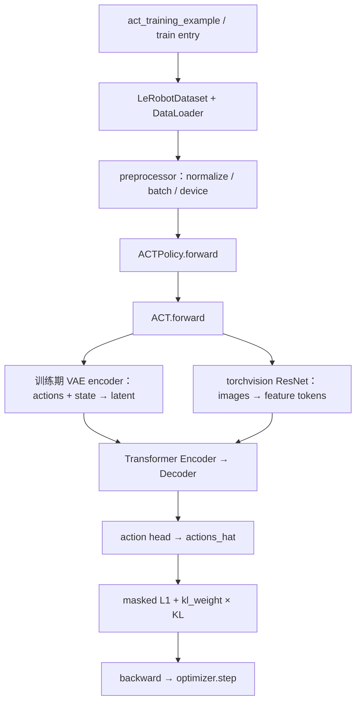
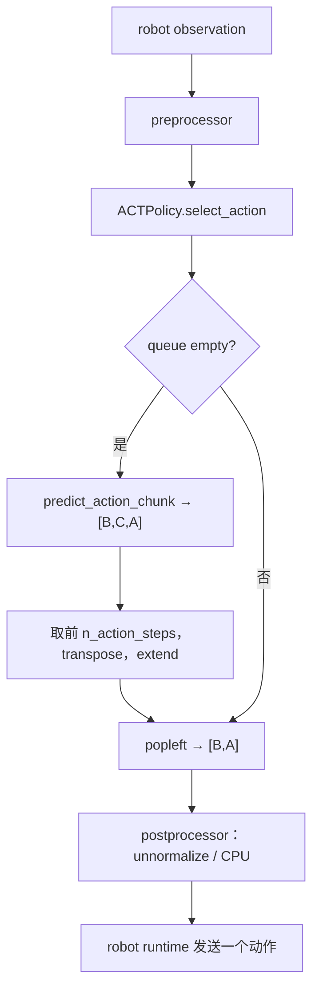
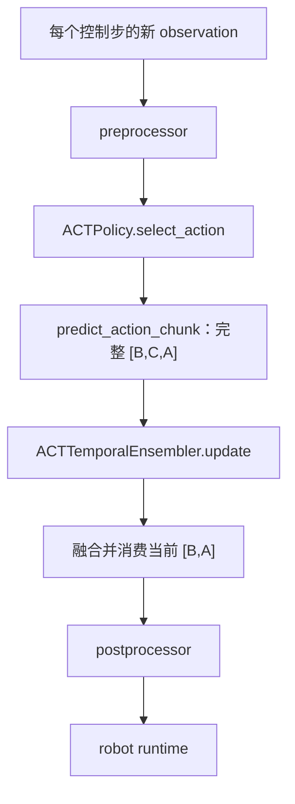

# 07 · 源码地图、调用链与版本边界

[上一篇：原始 ACT 对照](06_original_act_comparison.md) · [返回分支入口](../README.md) · [下一篇：数据闭环](08_data_closed_loop.md)

这页给前面各篇做“地图索引”。当结论与未来版本不一致时，先沿固定 commit 链接回到代码，不靠记忆补全。

## LeRobot 源码路径

| 文件 | 类/函数 | 本分支核对内容 |
| --- | --- | --- |
| [`examples/tutorial/act/act_training_example.py`](https://github.com/huggingface/lerobot/blob/1427d35ef58ab46651dc7ef78bde81642090c861/examples/tutorial/act/act_training_example.py) | `main()`, `make_delta_timestamps()` | Dataset metadata、feature schema、processor、DataLoader、训练循环、保存 |
| [`configuration_act.py`](https://github.com/huggingface/lerobot/blob/1427d35ef58ab46651dc7ef78bde81642090c861/src/lerobot/policies/act/configuration_act.py) | `ACTConfig` | chunk、动作执行长度、VAE、Transformer、Temporal Ensembling 约束 |
| [`modeling_act.py`](https://github.com/huggingface/lerobot/blob/1427d35ef58ab46651dc7ef78bde81642090c861/src/lerobot/policies/act/modeling_act.py) | `ACTPolicy` | `forward()`、`predict_action_chunk()`、`select_action()`、`reset()` |
| 同上 | `ACTTemporalEnsembler` | 指数权重、在线平均、时间对齐与消费 |
| 同上 | `ACT` | latent encoder、ResNet、主 Encoder/Decoder、action head |
| 同上 | `ACTEncoderLayer`, `ACTDecoderLayer` | attention、FFN、residual、norm、position embedding |
| [`policies/factory.py`](https://github.com/huggingface/lerobot/blob/1427d35ef58ab46651dc7ef78bde81642090c861/src/lerobot/policies/factory.py) | `make_pre_post_processors()`, `_make_processors_from_policy_config()` | 创建或加载 pipeline，并按 Policy 类型解析 ACT factory |
| [`processor_act.py`](https://github.com/huggingface/lerobot/blob/1427d35ef58ab46651dc7ef78bde81642090c861/src/lerobot/policies/act/processor_act.py) | `make_act_pre_post_processors()` | ACT 在当前基线中调用通用 pre/post helper |
| [`processor/factory.py`](https://github.com/huggingface/lerobot/blob/1427d35ef58ab46651dc7ef78bde81642090c861/src/lerobot/processor/factory.py) | `make_default_policy_processor_steps()`, `make_default_pre_post_processors()` | 固定 `Rename → Batch → Device → Normalize` 与 `Unnormalize → CPU` 顺序 |
| [`processor/pipeline.py`](https://github.com/huggingface/lerobot/blob/3f2179f3b69708b6ad009b2e7685dd9d05269ee1/src/lerobot/processor/pipeline.py) | `PolicyProcessorPipeline`, `DataProcessorPipeline.__call__()` | 输入转 `EnvTransition`、按顺序执行 Step、再转回输出 |
| [`rename_processor.py`](https://github.com/huggingface/lerobot/blob/3f2179f3b69708b6ad009b2e7685dd9d05269ee1/src/lerobot/processor/rename_processor.py) | `RenameObservationsProcessorStep` | 空 `rename_map` 保留原字段名 |
| [`batch_processor.py`](https://github.com/huggingface/lerobot/blob/3f2179f3b69708b6ad009b2e7685dd9d05269ee1/src/lerobot/processor/batch_processor.py) | `AddBatchDimensionProcessorStep` | 按 Tensor 维数判断是否补 batch 维 |
| [`device_processor.py`](https://github.com/huggingface/lerobot/blob/3f2179f3b69708b6ad009b2e7685dd9d05269ee1/src/lerobot/processor/device_processor.py) | `DeviceProcessorStep` | Tensor device 与可选 dtype 迁移，不负责机器人通信 |
| [`normalize_processor.py`](https://github.com/huggingface/lerobot/blob/3f2179f3b69708b6ad009b2e7685dd9d05269ee1/src/lerobot/processor/normalize_processor.py) | `NormalizerProcessorStep`, `UnnormalizerProcessorStep` | 按 feature type、mapping 与 stats 做正反变换 |
| [`pretrained.py`](https://github.com/huggingface/lerobot/blob/1427d35ef58ab46651dc7ef78bde81642090c861/src/lerobot/policies/pretrained.py) | `PreTrainedPolicy.save_pretrained()` | `config.json` 与 `model.safetensors` 保存 |

## ACT 原始官方代码路径

| 文件 | 核对内容 |
| --- | --- |
| [`policy.py`](https://github.com/tonyzhaozh/act/blob/742c753c0d4a5d87076c8f69e5628c79a8cc5488/policy.py) | 训练/推理分支、ImageNet normalize、masked L1 + KL |
| [`detr/models/detr_vae.py`](https://github.com/tonyzhaozh/act/blob/742c753c0d4a5d87076c8f69e5628c79a8cc5488/detr/models/detr_vae.py) | DETRVAE、14 维硬编码、latent encoder、query/action head |
| [`detr/models/backbone.py`](https://github.com/tonyzhaozh/act/blob/742c753c0d4a5d87076c8f69e5628c79a8cc5488/detr/models/backbone.py) | torchvision ResNet、FrozenBatchNorm 与位置编码 Joiner |
| [`detr/models/transformer.py`](https://github.com/tonyzhaozh/act/blob/742c753c0d4a5d87076c8f69e5628c79a8cc5488/detr/models/transformer.py) | Encoder/Decoder layer 与 intermediate decoder stack |
| [`imitate_episodes.py`](https://github.com/tonyzhaozh/act/blob/742c753c0d4a5d87076c8f69e5628c79a8cc5488/imitate_episodes.py) | 训练入口、`dec_layers=7`、query frequency、temporal aggregation、环境 step |
| [`utils.py`](https://github.com/tonyzhaozh/act/blob/742c753c0d4a5d87076c8f69e5628c79a8cc5488/utils.py) | HDF5 Dataset、future actions、padding、mean/std |

## 关键配置字段

| 字段 | 当前默认值 | 控制什么 | 真实性边界 |
| --- | --- | --- | --- |
| `chunk_size` | `100` | 模型一次预测的动作位置数 | 不代表我的 checkpoint 就是 100 |
| `n_action_steps` | `100` | 普通 queue 模式一次实际缓存/执行的前缀长度 | 必须 `≤ chunk_size` |
| `temporal_ensemble_coeff` | `None` | 是否启用在线 Temporal Ensembling，以及指数权重系数 | `None` 表示默认关闭 |
| `use_vae` | `True` | 是否用真实 actions 经 VAE encoder 构造 latent 与 KL | 推理 latent 取零 |
| `latent_dim` | `32` | latent 向量维度 | checkpoint 需单独核对 |
| `kl_weight` | `10.0` | 总 loss 中 KL 的权重 | 不等于 KL 一定主导训练 |
| `vision_backbone` | `resnet18` | torchvision 图像 backbone | 预训练权重另由 config 控制 |
| `n_encoder_layers` | `4` | 主 Transformer Encoder 层数 | VAE Encoder 另有层数 |
| `n_decoder_layers` | `1` | 主 Transformer Decoder 层数 | 为匹配原始实际输出路径 |
| `pre_norm` | `False` | pre-norm / post-norm | 当前默认 post-norm |
| `dim_model` | `512` | Transformer 隐藏维度 `D` | shape 说明中的 `D` |

## 训练调用链

关键源码节点：

1. [Dataset、processor 与 DataLoader](https://github.com/huggingface/lerobot/blob/1427d35ef58ab46651dc7ef78bde81642090c861/examples/tutorial/act/act_training_example.py#L27-L75)，Step 级拆解见 [09 · `preprocessor(batch)`](09_preprocessor_batch.md)
2. [`ACTPolicy.forward()` loss](https://github.com/huggingface/lerobot/blob/1427d35ef58ab46651dc7ef78bde81642090c861/src/lerobot/policies/act/modeling_act.py#L123-L154)
3. [`ACT.forward()` latent 分支](https://github.com/huggingface/lerobot/blob/1427d35ef58ab46651dc7ef78bde81642090c861/src/lerobot/policies/act/modeling_act.py#L367-L460)
4. [图像/state token 与 Transformer](https://github.com/huggingface/lerobot/blob/1427d35ef58ab46651dc7ef78bde81642090c861/src/lerobot/policies/act/modeling_act.py#L461-L518)
5. [backward 与 optimizer.step](https://github.com/huggingface/lerobot/blob/1427d35ef58ab46651dc7ef78bde81642090c861/examples/tutorial/act/act_training_example.py#L79-L95)

## 普通 action queue 推理链

Policy 源码只覆盖 `select_action` 到 `[B,A]`；pre/postprocessor 与机器人发送属于外层运行时。把这些节点分开，才能避免误写成 `predict_action_chunk()` 直接控制舵机。

## Temporal Ensembling 推理链

这条链里没有普通 queue。`update()` 自己维护未来在线平均，但它不是 `deque`，也不会让模型隔 `n_action_steps` 才推理。

## 本次修正的原有理解

| 原先容易形成的理解 | 当前源码实际实现 | 为什么修正 |
| --- | --- | --- |
| `forward()` 就是推理动作接口 | Policy `forward()` 返回 loss；推理走另外两个方法 | Policy 层把训练目标和控制循环明确分开 |
| `predict_action_chunk()` 已经给出可直接执行动作 | 返回仍在模型空间；postprocessor 外部反归一化 | normalization 属于 processor pipeline |
| action chunk 与 queue 是同一段数据的两个叫法 | chunk 是 `[B,C,A]` 模型输出；queue 是按时间拆开的缓存 | 两者创建位置、生命周期与功能不同 |
| Temporal Ensembling 是 queue 上的平滑 | 开启后 `select_action()` 提前进入独立分支，每步推理 | 没有 `extend/popleft` 路径 |
| 指数衰减一定偏向新预测 | 当前索引 `i=0` 是最旧预测；正系数偏旧 | 必须结合数组顺序理解公式 |
| 原始 ACT 的 action head 使用 7 层 Decoder 最后一层 | 原始 stack 被 `[0]` 取第一层；LeRobot 默认 1 层匹配 | 配置构造层数不等于最终输出索引 |

## 版本边界

- 2026-07-16 的 `algorithm-notes` 使用 LeRobot `3f2179f`；本分支在 2026-07-22 使用 `1427d35e` 重新检查。
- `act_training_example.py`、`configuration_act.py` 与 `modeling_act.py` 在两次基线中的 blob SHA 相同。
- 聊天上传的 `processor_act.py` 显式组装 processor steps，上传文件本身没有 commit metadata；其结构与固定 commit `3f2179f3b69708b6ad009b2e7685dd9d05269ee1` 的函数、顺序和关键参数一致，但不能因此声称 blob 完全相同。
- 到 `1427d35e`，`processor_act.py` 已重构为调用通用 helper；同 commit 的 `processor/factory.py` 明确保留相同的四步 preprocessor 与两步 postprocessor 顺序。checkpoint 对应的具体 processor 资产仍要按实验版本读取。
- ACT 核心结论只对这里列出的固定 commit 负责；后续 LeRobot 可能继续移动 normalization、processor 或 Policy API。
- 我的 ACT 训练 checkpoint 没有在仓库中保存精确上游 SHA，所以本文只称“源码核对基线”，不称“实验版本”。

## 证据层级

| 层级 | 本分支允许写的内容 | 例子 |
| --- | --- | --- |
| SO-101 真实实验 | 现有日志、配置和视频能支持的过程/现象 | 已走通 ACT 训练与真机部署；10 episodes 视频中动作相对连续 |
| 本次源码核对 | 固定 commit 中真实存在的类、字段与执行路径 | Temporal Ensembling 默认关闭；queue 与 ensembler 是互斥路径 |
| ACT 论文/官方代码 | 原作者提出或实现的机制 | CVAE action chunk、temporal aggregation、ALOHA 14 维接口 |
| 待验证推断 | 需要新实验或旧 checkpoint 才能确认 | 我的部署是否开启 Temporal Ensembling；哪个 `n_action_steps` 最适合抓胶水 |

我没有把“源码里能配置”写成“实验中已经启用”，也没有把“机制可能平滑动作”写成“现有视频已经证明”。这条边界比把所有表格填满更重要。
