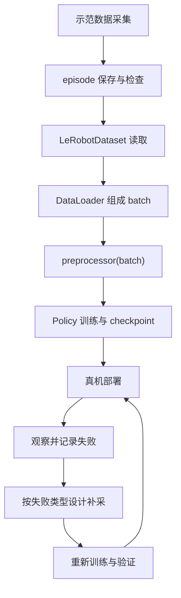
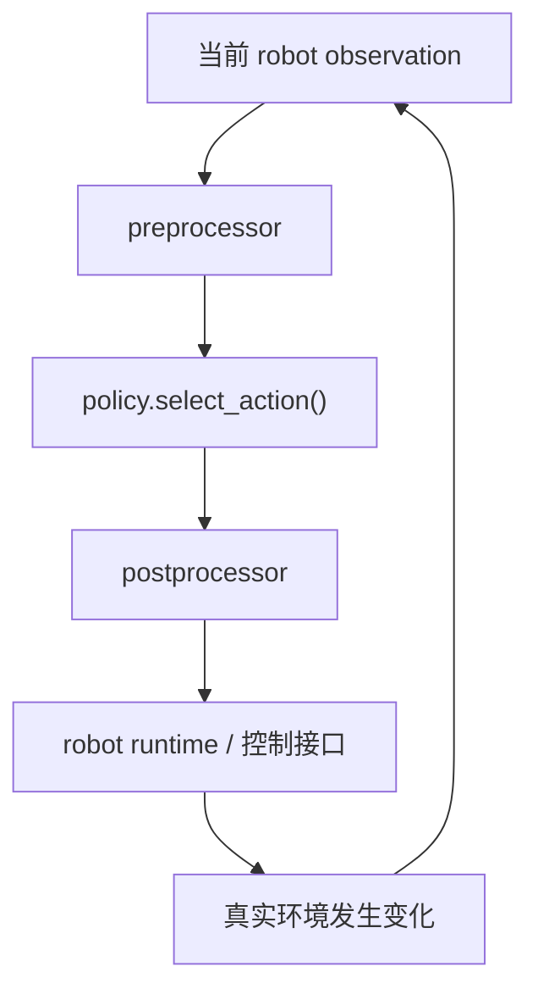

# 08 · 从一次数据采集到下一轮数据：我的 LeRobot 数据闭环

[上一篇：源码地图](07_source_map.md) · [返回分支入口](../README.md) · [下一篇：`preprocessor(batch)`](09_preprocessor_batch.md)

我最初把模仿学习的流程想得很直：录制示范、运行训练命令、加载 checkpoint，机器人能动起来就算收工。真机跑完 `Grab the glue` 后，这条直线很快拐成了一个圈——模型只见过我示范过的状态，机器人一旦自己走偏，后面遇到的场景可能已经不在原数据里。

所以这里说的“数据闭环”不是某个自动运转的 LeRobot 类，也不是给 episode 数量加个零。它是一套需要我持续观察和设计的实验流程：



## 一条 episode 怎样进入训练

录制阶段保存的不只是“机械臂动过一次”的视频。LeRobot 数据集还要保存与时间对齐的 observation、action、episode 元信息、任务信息和统计量。以本次固定源码基线为例，数据集目录由 Parquet、视频与 `meta/` 下的信息共同组成；`stats` 会在后面的 normalization 中继续使用。

训练读取链可以拆成四层：

```text
episode 文件
→ LeRobotDataset.__getitem__(idx)
→ DataLoader collate 成 batch
→ preprocessor(batch)
→ ACTPolicy.forward(batch)
```

- `LeRobotDataset` 负责按索引取出一条样本，并处理相对时间窗口、视频帧和数据集级图像 transform。
- 当前固定基线 `1427d35e` 中，`LeRobotDataset.__getitem__()` 把具体读取委托给 `DatasetReader.get_item()`；聊天中上传的 `lerobot_dataset.py` 展示的是同一职责链的具体展开。两者不能因为函数名相同就当成同一文件版本。
- `DataLoader` 把多条 sample 沿 batch 维拼起来。Dataset 交出的是“样本”，DataLoader 才负责把它们装成一批。
- `preprocessor(batch)` 把 batch 整理成 Policy 约定的字段、设备和数值尺度。
- `ACTPolicy.forward(batch)` 接收处理后的 observation、真实 action chunk 与 padding mask，预测动作并计算 loss。

这里让我修正的地方是：Dataset 把货从仓库里找出来，并不代表 ACT 已经能直接签收。DataLoader 负责装箱，processor 负责标签、设备和计量单位，Policy 才开始学习。📦

## 训练路径只是闭环的上半圈

训练入口中的核心路径是：

```text
DataLoader batch
→ preprocessor(batch)
→ policy.forward(batch)
→ loss.backward()
→ optimizer.step()
→ checkpoint + processor assets
```

这段代码能完成离线参数更新，但 loss 只回答“模型在已有数据分布里与示范动作差多少”。它不会自动告诉我：

- 胶水初始位置换到示范边缘后是否仍能抓到；
- 夹爪靠偏一点后，模型是否知道怎样救回来；
- 抽动来自数据不一致、action chunk 边界、控制频率还是推理延迟；
- 这轮新增的 episode 是否真的覆盖了旧数据没见过的状态。

checkpoint 是这半圈的产物，不是闭环的终点。

## Policy 怎样回到真实机器人

部署时没有真实 future action，数据方向也从“监督模型”变成“驱动控制循环”：



这几个节点不能合并：

- preprocessor 处理当前 observation，不会凭空生成训练标签；
- `select_action()` 返回模型空间中的单步 action；
- postprocessor 做 action unnormalization 并移回 CPU；
- 更外层 robot runtime 才把动作交给机器人控制接口；
- 下一帧 observation 会包含刚才动作造成的真实结果。

因此，postprocessor 的输出还不能直接叫“已经写入舵机”。它只是从模型动作尺度回到控制链可继续消费的动作表示。串口、总线、关节限位与实际执行属于后面的机器人接口。

## 真机为什么会走进数据集没见过的状态

`covariate shift` 可以先理解成“训练时看见的路，和部署时自己走出来的路不完全一样”。

示范数据主要来自操作者走过的正确轨迹。训练中的输入分布大致是：

```text
人类示范产生的 observation → 人类给出的正确 action
```

部署后却变成：

```text
Policy 产生 action → 机器人进入下一状态 → Policy 再观察
```

如果第一个动作只有一点误差，下一帧夹爪可能稍微靠偏；模型若很少见过这种状态，第二个动作又可能继续偏。小误差像滚雪球一样累积，这就是模仿学习里常见的 covariate shift。

在抓胶水任务中，标准成功轨迹可能总是从相似位置平稳靠近。真机一旦因为曝光、目标位置或机械误差偏离这条“熟路”，Policy 就开始面对训练集中很稀疏的状态。

## recovery demonstration 不是再录一遍标准答案

`recovery demonstration` 是从“已经有些不理想的状态”开始，示范怎样回到可成功完成任务的轨迹。例如：

- 夹爪已经偏到胶水一侧，先退回、重新对准再靠近；
- 胶水被碰歪后，重新观察并调整抓取方向；
- 闭合过早但还没夹住，重新张开并二次定位。

它和重复采集标准成功轨迹的差别在于起点。标准示范教模型“正常情况下怎么做”；recovery demonstration 教模型“已经不太正常时怎么回来”。

> 🧠 我最初把“补数据”理解成继续录更多成功动作。后来才意识到，如果机器人总在夹爪靠偏后失败，我却继续录完全标准的成功轨迹，就像错题没看，先把会做的题又抄了几十遍。

我目前没有证据证明重新采集的 50 episodes 属于 recovery demonstration，所以不会给它们补上这个标签。按失败类型专门补采恢复样本，是下一轮闭环计划，不是已经完成的结果。

## 按失败类型决定下一轮采什么

下面的“可能缺失”是诊断假设，不是看到现象就能直接定案。每一项还要结合日志、视频、控制周期和配置继续排查。

| 真机现象 | 可能缺失或不一致的数据 | 下一轮采集目标 | 还要单独排查 |
| --- | --- | --- | --- |
| 夹爪总从固定方向靠偏 | 目标横向位置、视角或手眼误差附近样本不足 | 有计划地改变胶水横向位置，并保持动作语义一致 | 相机标定、裁剪、feature key |
| 接近目标时碰倒胶水 | 慢速接近与轻微偏差恢复样本不足 | 增加不同接近角度、靠近速度和碰偏后的恢复示范 | 动作尺度、关节响应、延迟 |
| 抓取前过早闭合 | “到位再闭合”的时序不一致 | 统一闭合时机，补充临界距离附近的正确示范 | control FPS、action chunk 时间含义 |
| 偏离后继续向错误方向走 | 数据几乎只有标准成功轨迹 | 从偏移状态开始录退回、重定位、二次抓取 | observation 是否及时更新 |
| Diffusion Policy 动作分段或抽动 | 示范速度/动作一致性不足只是候选原因之一 | 对动作速度、停顿和关键阶段做一致性检查后再定向补采 | DDIM 步数、推理延迟、控制频率、action horizon |
| 某些初始位置表现明显更差 | 初始状态覆盖不均 | 按位置区间分层采集，而不是随机多录 | 数据分桶统计、相机边界 |

“多录一些”是采集动作，不是采集目标。下一轮应该先回答：我想增加哪一类状态的密度？我想验证哪一种失败假设？

## 数量增加不等于覆盖变好

episode 数量只告诉我“录了多少段”，不能单独说明以下问题：

- 场景是否覆盖了不同初始位置、目标姿态和光照；
- 示范动作是否在相同状态下给出相近选择；
- 是否包含模型容易进入的失败状态；
- 是否包含从失败状态恢复的动作；
- 关键阶段的数据比例是否合理；
- 相机、state、action 与时间戳是否对齐。

50 条几乎相同的成功轨迹，可能只是让同一小块数据分布更密。10 条有组织的数据也不一定更好；这里不能从数量直接推导质量。数据规模、覆盖范围和示范一致性要分开看。

## 已完成、已观察与下一轮计划

| 状态 | 内容 | 我能说到什么程度 |
| --- | --- | --- |
| 已完成 | ACT 第一版使用 10 episodes 完成训练与真机部署 | 已走通流程；不虚构成功率和定量稳定性 |
| 已完成 | Diffusion Policy 第一版使用与 ACT 相同的 10 episodes | 可以做同源数据下的实现观察，但不等于严格算法对照 |
| 已完成 | Diffusion Policy 第二版使用重新采集的 50 episodes | 50 episodes 是重新采集数据，不自动等于 recovery data |
| 已观察 | 50 episodes 没有自动解决 Diffusion Policy 的全部抽动问题 | 这是视频/真机现象，不写成统计结论 |
| 待拆分 | 数据质量、action chunk/horizon、推理延迟与控制频率对抽动的影响 | 这些因素需要分别记录和验证，不能只归因于算法或数据 |
| 下一轮计划 | 建立失败类型记录表并定向补采 | 尚未完成按失败类型补采和严格对照实验 |
| 下一轮计划 | 对初始位置、失败状态和动作一致性做分层检查 | 先定义变量，再比较新旧数据和 checkpoint |

这张表是我的真实性边界：我已经做过什么、看见过什么、准备验证什么，不混在同一个完成时里。

## 哪些由 LeRobot 完成，哪些仍然需要我

| 环节 | LeRobot 代码可以完成 | 仍需人工判断/设计 |
| --- | --- | --- |
| 采集与保存 | 记录 observation/action、切分 episode、保存媒体与元数据 | 示范动作是否一致、场景怎样分层 |
| Dataset 与 batch | 读取样本、时间窗口、视频帧，DataLoader 组成 batch | 检查坏帧、错位、异常动作和覆盖缺口 |
| processor | 字段整理、batch 维、device、normalization/unnormalization | 确认 feature、stats 与 checkpoint 是否匹配 |
| 训练与保存 | forward、loss、优化、保存 Policy 和 processor assets | 设定实验变量、保留配置、解释 loss 与真机差异 |
| 推理与机器人调用 | observation → Policy → action 的软件链路 | 观察失败、判断是否安全、记录失败类型 |
| 下一轮数据 | LeRobot 能继续录制和训练 | 决定补采什么、如何形成对照、何时停止 |

LeRobot 不会仅靠一个类或函数自动完成“观察失败—分类—补采—重训”。闭环里的代码很长，但真正决定下一轮数据价值的那一步，仍然需要我看视频、查日志、提出可验证的假设。

## 源码与版本边界

- 源码检查日期：**2026-07-23**。
- 本分支继续使用 LeRobot [`1427d35ef58ab46651dc7ef78bde81642090c861`](https://github.com/huggingface/lerobot/tree/1427d35ef58ab46651dc7ef78bde81642090c861) 作为远程源码核对基线。
- 聊天上传的 `lerobot_dataset.py` 与 `act_training_example.py` 用于追踪学习时看到的调用链；上传文件没有可验证的 Git commit metadata，不能倒推为旧 checkpoint 的精确版本。
- 当前固定基线的 `LeRobotDataset.__getitem__()` 已委托给 `DatasetReader.get_item()`；这属于工程重构边界，不改变“Dataset 负责单样本读取、processor 位于其下游”的模块分工。
- 我的 ACT 与 Diffusion Policy checkpoint 对应的精确 LeRobot SHA 仍需从旧环境、配置或本地记录继续核对。

## 证据表

| 我的理解 | LeRobot 源码证据 | SO-101 实验对应 | 真实性状态 |
| --- | --- | --- | --- |
| Dataset 与 processor 是相邻但独立的层 | [`LeRobotDataset.__getitem__()`](https://github.com/huggingface/lerobot/blob/1427d35ef58ab46651dc7ef78bde81642090c861/src/lerobot/datasets/lerobot_dataset.py)；[`act_training_example.py`](https://github.com/huggingface/lerobot/blob/1427d35ef58ab46651dc7ef78bde81642090c861/examples/tutorial/act/act_training_example.py) 中 DataLoader 后调用 `preprocessor(batch)` | 我沿 Dataset 继续追到 batch 与 processor | 源码已确认；上传文件 commit 未确认 |
| 训练 batch 先处理再进入 `forward()` | [训练循环](https://github.com/huggingface/lerobot/blob/1427d35ef58ab46651dc7ef78bde81642090c861/examples/tutorial/act/act_training_example.py#L69-L91) | ACT 使用 10 episodes 训练并部署 | 调用链已确认；训练指标未虚构 |
| 推理动作要经过外部 postprocessor | [`processor_act.py`](https://github.com/huggingface/lerobot/blob/1427d35ef58ab46651dc7ef78bde81642090c861/src/lerobot/policies/act/processor_act.py) 与 [`processor/factory.py`](https://github.com/huggingface/lerobot/blob/1427d35ef58ab46651dc7ef78bde81642090c861/src/lerobot/processor/factory.py) | 真机部署走 Policy 外围运行链路 | 源码已确认；旧 checkpoint processor 版本待核对 |
| 50 episodes 不自动代表覆盖更好 | 这不是单个 LeRobot 函数能证明的结论 | DP 第二版用重新采集的 50 episodes，仍观察到部分抽动 | 实验现象已记录；原因未定量归因 |
| recovery demonstration 应从失败/偏移状态示范恢复 | 属于下一轮数据设计，不是当前 LeRobot 自动标签 | 尚未证明 50 episodes 包含恢复示范 | 计划验证，未写成已完成 |
| 完整闭环需要人工失败分类与补采设计 | LeRobot 提供采集、读取、训练与推理组件，没有自动完成这套实验决策 | 下一轮准备按失败类型分层采集 | 计划，不是自动化成果 |
