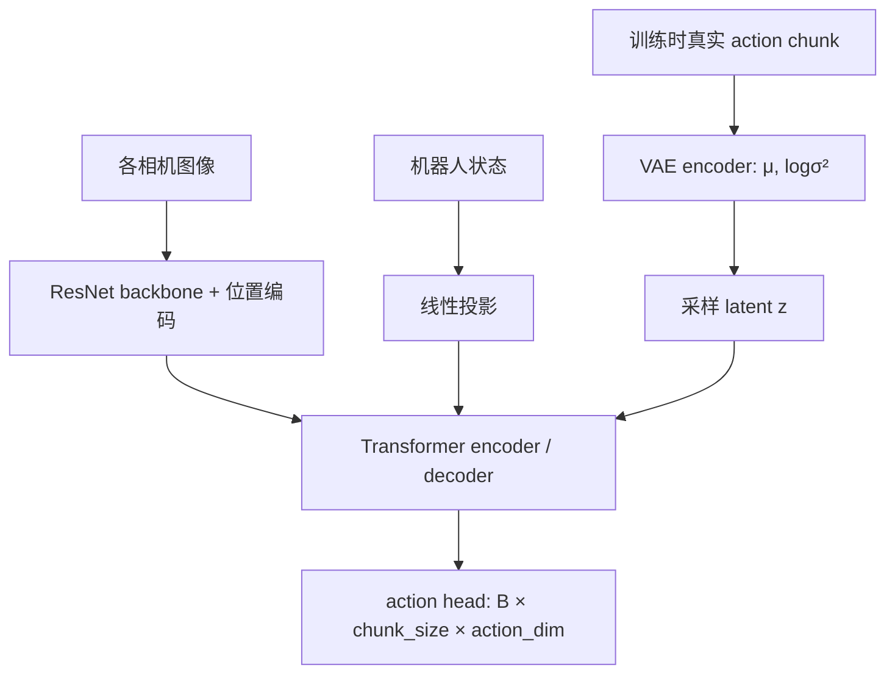

# ACT：动作分块、CVAE 与真机执行

[返回本分支入口](../README.md) · [返回 `main`](https://github.com/Zeil6/lerobot-so101-imitation-learning/tree/main)

> 核对基线：LeRobot [`3f2179f`](https://github.com/huggingface/lerobot/tree/3f2179f3b69708b6ad009b2e7685dd9d05269ee1)，检查日期 2026-07-16。实验 checkpoint 的精确 LeRobot SHA 尚未保存，因此下文会把当前源码与实验记录分开。

## 1. 从 SO-101 抓胶水理解行为克隆

在我的任务里，一条 observation 至少包含 `handeye`、`fixed` 两路图像和 Follower 的机器人状态；action 是示范者通过 Leader 给出的下一步关节/执行器目标。录制的 episode 把时间上连续的 observation 与 action 对齐，训练时再切成带历史或未来窗口的监督样本。

行为克隆学习的是“在示范分布里的相似观测下，模仿示范动作”。它没有独立的试错奖励，也不会因为训练 loss 下降就自动获得失败恢复能力。真机稍微偏离示范轨迹后，新状态可能已在数据分布之外；此时早期小误差会改变后续输入，形成错误累积。

## 2. 为什么不是每帧只预测一个动作

ACT 一次预测 `chunk_size` 个未来动作。对抓胶水而言，可以把它理解为共同建模“接近—对准—闭合”中的一小段，而不是让每帧互不相关地猜下一步。

- chunk 太短：模型调用更频繁，局部轨迹约束变弱，控制循环更容易暴露推理抖动。
- chunk 太长：一个预测覆盖更长未来，但执行越久越依赖旧观测，偏差发生后纠正更慢。
- `chunk_size` 是模型输出的完整长度；当前 LeRobot 的 `n_action_steps` 是普通队列模式下一次保留并执行的动作数，必须不大于 `chunk_size`。

在 [`ACTConfig`](https://github.com/huggingface/lerobot/blob/3f2179f3b69708b6ad009b2e7685dd9d05269ee1/src/lerobot/policies/act/configuration_act.py) 中，本次检查到的默认值是 `chunk_size=100`、`n_action_steps=100`。默认值不代表我的 checkpoint 一定采用该值，实际复现实验应以保存的 `config.json` 为准。

## 3. 当前 LeRobot ACT 的模型结构

关键实现位于 [`modeling_act.py`](https://github.com/huggingface/lerobot/blob/3f2179f3b69708b6ad009b2e7685dd9d05269ee1/src/lerobot/policies/act/modeling_act.py)：`ACTPolicy` 负责预处理后的策略接口和动作消费，`ACT` 负责 CVAE、视觉 backbone、Transformer 与 action head。

我从源码核对到的职责分工：

- 图像：每个相机通过 ResNet 特征图，再展平为空间 token；二维位置编码随 token 一起进入 Transformer。
- 机器人状态：先线性投影；在 CVAE 训练编码器中也与真实动作、CLS token 一起使用。
- CVAE latent：训练时由真实动作 chunk 编码出 `mu` 和 `log_sigma_x2`，随后重参数采样；推理时 latent 直接置零。
- Transformer：编码视觉、状态与 latent 条件，并用 `chunk_size` 个 decoder query 形成动作序列表示。
- action head：把 decoder 输出映射为动作维度。
- padding：`action_is_pad` 既作为 VAE encoder 的 key-padding mask，也用于训练 L1 loss 避开补齐位置。

当前配置默认 `use_vae=True`。因此“ACT 就是普通确定性 Transformer 回归”并不准确；但也不能据此声称我的少量数据实验已经验证了完整多模态能力。

## 4. 训练与推理为什么不同

### 训练：`forward()`

[`ACTPolicy.forward()`](https://github.com/huggingface/lerobot/blob/3f2179f3b69708b6ad009b2e7685dd9d05269ee1/src/lerobot/policies/act/modeling_act.py) 把真实 action chunk 交给模型：

1. VAE encoder 用机器人状态、真实动作和 padding mask 计算 latent 分布。
2. Transformer 在视觉、状态和采样 latent 条件下预测完整 chunk。
3. 对非 padding 动作计算 L1 重建损失。
4. `use_vae=True` 时计算 KL，并组合为 `l1_loss + kl_weight × mean_kld`。

KL 把训练时编码出的 latent 分布约束到接近标准正态，使推理时采用先验成为可能。当前 LeRobot 推理具体使用零 latent，而不是再从真实动作编码 latent。

### 推理：`select_action()`

推理时没有未来真实 action，VAE encoder 不参与。`ACTPolicy.predict_action_chunk()` 生成完整 chunk，之后有两条互斥路径：

- 普通队列：队列为空时生成 chunk，取前 `n_action_steps` 放入 deque；控制循环每次 `popleft()` 一个动作。
- Temporal Ensembling：每个控制时刻都重新预测完整 chunk，再融合不同历史预测对同一未来时刻的估计。

归一化不是隐含在机器人驱动里。当前 [`processor_act.py`](https://github.com/huggingface/lerobot/blob/3f2179f3b69708b6ad009b2e7685dd9d05269ee1/src/lerobot/policies/act/processor_act.py) 构造输入/特征归一化和输出反归一化处理器；ACT 默认对 state/action 使用 `MEAN_STD`。这也解释了为什么 checkpoint、数据统计与部署输入不能随意混用。

## 5. Temporal Ensembling 不是普通动作队列

当前 LeRobot 用 `temporal_ensemble_coeff` 控制 Temporal Ensembling，默认值是 `None`，即**默认关闭**。启用时 [`ACTTemporalEnsembler`](https://github.com/huggingface/lerobot/blob/3f2179f3b69708b6ad009b2e7685dd9d05269ee1/src/lerobot/policies/act/modeling_act.py) 保存最近若干 chunk 中对当前时刻仍有效的预测，并按指数权重融合。

它与队列模式的区别不只是“平滑强弱”：

| 模式 | 何时重新推理 | 当前动作来自哪里 | 配置约束 |
| --- | --- | --- | --- |
| 普通队列 | 队列耗尽时 | 最近一次 chunk 的下一项 | `n_action_steps <= chunk_size` |
| Temporal Ensembling | 每个控制时刻 | 多个重叠 chunk 对当前时刻的加权结果 | 当前源码要求 `n_action_steps=1` |

原始 ACT 官方评估代码也实现了指数加权时间聚合，权重系数写为 `k=0.01`；LeRobot 配置注释把 `0.01` 标为原始实现使用值。由于我没有做开启/关闭对照，不能把 ACT 视频中的相对连续性只归因于 Temporal Ensembling。

## 6. LeRobot ACT 与原始 ACT 实现

对照基线是原始官方仓库 [`tonyzhaozh/act@742c753`](https://github.com/tonyzhaozh/act/tree/742c753c0d4a5d87076c8f69e5628c79a8cc5488)。

| 维度 | 原始 ACT 官方代码 | 本次检查的 LeRobot ACT | 我的判断 |
| --- | --- | --- | --- |
| 原始任务/硬件 | ALOHA 双臂，代码中 `state_dim=14` | feature schema 决定 state/action 维度 | SO-101 单臂适配来自通用数据与配置接口，不是原论文硬件原样复刻 |
| 数据接口 | HDF5：`qpos`、`qvel`、`action`、多相机图像 | LeRobotDataset + `PolicyFeature` | 数据组织和训练入口已工程化，但核心监督信号仍是图像/状态到动作序列 |
| 摄像头 | `camera_names` 列表进入模型 | `image_features` 从 config 解析，多相机各过 backbone | 部署 observation key 与训练数据必须一致 |
| 配置 | argparse 与 task config 字典 | `ACTConfig` + pretrained config/checkpoint | LeRobot 更方便复用，但必须核对本地版本字段 |
| 模型封装 | `ACTPolicy` 包装 DETRVAE | `PreTrainedPolicy` 下的 `ACTPolicy`/`ACT` | 命名相似不等于 checkpoint 互通 |
| 训练目标 | masked L1 + `kl_weight × KL` | 同样的组合形式 | 这是继承关系中最直接的一部分 |
| 推理接口 | 评估循环按 query frequency 取动作 | `select_action()` 管理 queue/ensembler | LeRobot 把部署消费逻辑放入 Policy 接口 |
| Temporal Ensembling | `all_time_actions` + 指数权重 | 有限历史缓冲的在线 ensembler | 目的相同，存储和接口不同 |
| normalization | qpos/action mean/std | processor + dataset stats；ACT state/action 默认 MEAN_STD | LeRobot 将其变成可复用预/后处理链 |
| Transformer decoder 层数 | 构造多层 decoder，但原代码调用路径存在只使用首层的问题 | 默认 `n_decoder_layers=1`，源码注释明确为匹配原始行为 | 这是本次源码核对到的非显然工程差异 |
| checkpoint | PyTorch 状态与统计文件 | Hugging Face 风格 config、权重和 processor 统计 | 不应直接互换 |

原始依据可从 [`policy.py`](https://github.com/tonyzhaozh/act/blob/742c753c0d4a5d87076c8f69e5628c79a8cc5488/policy.py)、[`detr_vae.py`](https://github.com/tonyzhaozh/act/blob/742c753c0d4a5d87076c8f69e5628c79a8cc5488/detr/models/detr_vae.py) 和 [`imitate_episodes.py`](https://github.com/tonyzhaozh/act/blob/742c753c0d4a5d87076c8f69e5628c79a8cc5488/imitate_episodes.py) 复查。

## 7. 映射回我的 SO-101 实验

| 我的理解 | LeRobot 源码证据 | 原始论文/官方代码 | SO-101 实验对应 |
| --- | --- | --- | --- |
| ACT 预测动作块，不是单步动作 | `ACTConfig.chunk_size`、decoder queries、action head | ACT 论文与 `num_queries=chunk_size` | 10 个 episode 跑通训练和 Follower 部署 |
| 训练与推理 latent 路径不同 | `ACT.forward()` 在无 action 时使用零 latent | 原始 DETRVAE 同样在推理使用零 latent | 部署不需要 Leader 或未来真实动作 |
| 双相机提高视觉输入量，也影响显存 | 每个 `image_feature` 都提取特征并形成 token | 原始代码也按 camera list 组织图像 | `handeye` + `fixed`；训练出现 CUDA OOM，降低 batch size 后继续 |
| 动作连续性不能只归因于一个开关 | queue 与 Temporal Ensembling 是不同执行路径，后者默认关闭 | 原始代码可选 temporal aggregation | 视频观察为“相对连续”，没有开关消融与成功率统计 |
| 部署 schema 必须一致 | config 验证输入 feature，processor 按统计归一化 | 原始代码同样依赖相机顺序与统计 | 相机名称、数量需与训练数据一致 |

## 8. 阶段性反思与待验证

我最初把 action chunk 主要理解成“减少逐帧抖动”。本次进一步核对代码后，我修正为：chunk 同时改变了训练目标、推理频率和闭环长度；普通队列只执行 chunk 的一部分，而 Temporal Ensembling 是另一条每步重算并融合的路径。

仍需验证：我的 checkpoint 是否启用了 Temporal Ensembling、保存的 `chunk_size/n_action_steps` 精确值、开启/关闭聚合的真机对照，以及多 checkpoint 的统一测试。没有这些证据前，我只保留视频中“动作相对连续”的观察。
