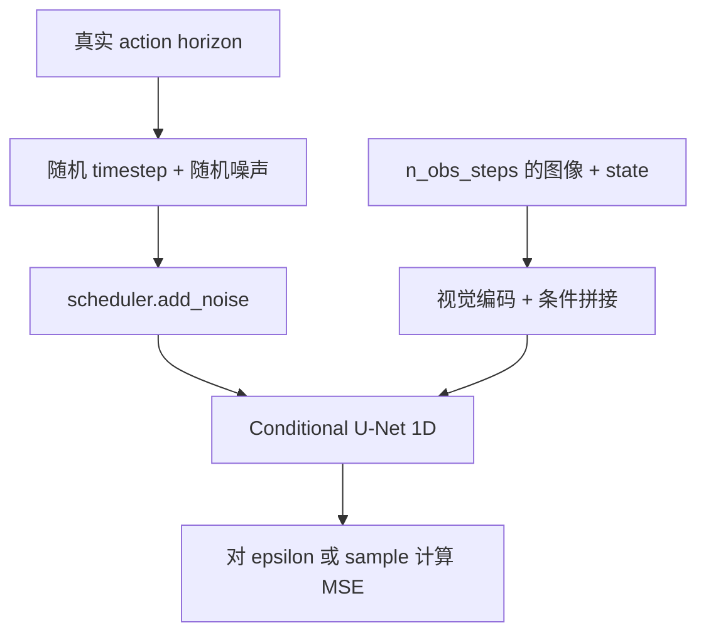

# Diffusion Policy：动作去噪、scheduler 与动作队列

[返回本分支入口](../README.md) · [返回 `main`](https://github.com/Zeil6/lerobot-so101-imitation-learning/tree/main)

> 核对基线：LeRobot [`3f2179f`](https://github.com/huggingface/lerobot/tree/3f2179f3b69708b6ad009b2e7685dd9d05269ee1)，检查日期 2026-07-16。实验配置来自现有仓库记录；上游当前默认值只用于解释实现，不能替代 checkpoint 配置。

## 1. 为什么把动作序列看成生成问题

抓胶水可能存在多条合理接近轨迹：夹爪可从略不同方向靠近，只要最后进入可抓取姿态。若同一观测附近的示范包含多个模式，单一逐步回归容易把它们平均成未必合理的中间动作。

Diffusion Policy 不直接把 observation 映射成唯一动作，而是在图像和机器人状态条件下学习一个动作序列分布。训练时破坏真实动作序列，学习如何恢复；推理时从随机动作噪声出发，经多轮去噪得到一个候选序列。这种多模态表达是优势，但连续控制里相邻两次生成也可能落到略不同的局部轨迹，所以动作块边界仍要处理。

## 2. 训练：真实动作怎样变成去噪目标

当前 LeRobot 的主实现位于 [`modeling_diffusion.py`](https://github.com/huggingface/lerobot/blob/3f2179f3b69708b6ad009b2e7685dd9d05269ee1/src/lerobot/policies/diffusion/modeling_diffusion.py)，配置位于 [`configuration_diffusion.py`](https://github.com/huggingface/lerobot/blob/3f2179f3b69708b6ad009b2e7685dd9d05269ee1/src/lerobot/policies/diffusion/configuration_diffusion.py)。

源码中的训练顺序是：

1. processor 使用数据集统计归一化 observation 和 action。
2. 每路 RGB 经过视觉编码器；图像特征与机器人状态按 `n_obs_steps` 展平为 global condition。
3. 为 batch 中每条动作 horizon 采样随机噪声和随机 `timestep`。
4. scheduler 的 `add_noise()` 得到带噪动作。
5. Conditional U-Net 1D 接收带噪动作、timestep 和 observation condition。
6. `prediction_type="epsilon"` 时 target 是加入的噪声；`"sample"` 时 target 是干净动作，最后计算 MSE。

本次检查的 LeRobot 默认 `prediction_type="epsilon"`。所以“Diffusion Policy 一定预测噪声”要加版本和配置限定；当前代码也支持 `sample`。

## 3. 推理：从随机动作噪声到队列

[`DiffusionModel.generate_actions()`](https://github.com/huggingface/lerobot/blob/3f2179f3b69708b6ad009b2e7685dd9d05269ee1/src/lerobot/policies/diffusion/modeling_diffusion.py) 先创建形状为 `(batch, horizon, action_dim)` 的高斯噪声。scheduler 设置实际推理 timesteps 后，代码在循环中反复调用 U-Net 和 `scheduler.step()`，逐步得到动作序列。

完整序列不会全部发送给机械臂。代码以 `start = n_obs_steps - 1` 为当前时刻，从预测 horizon 中截取 `n_action_steps`。`DiffusionPolicy.select_action()` 在动作队列为空时生成并入队；后续控制周期只 `popleft()`，直到队列再次为空。

这给出了我真机停顿分析中的关键时刻：**动作队列耗尽后，下一批动作必须等待完整的多轮去噪**。增加 episode 数量可以改善数据覆盖，却不会缩短一次已经确定的 100-step 推理循环。

## 4. 关键参数不是彼此独立的旋钮

| 参数 | 代码中的作用 | 对真机控制的含义 |
| --- | --- | --- |
| `horizon` | U-Net 建模的完整动作序列长度 | 越长并不等于执行越久；还受截取位置和 `n_action_steps` 约束 |
| `n_obs_steps` | 缓存多少历史 observation，并决定条件维度 | 更多历史可提供运动信息，也增加输入与编码开销 |
| `n_action_steps` | 每次生成后真正入队执行的动作数 | 短：更频繁重推理；长：更开环，反馈纠偏更慢 |
| `num_train_timesteps` | 训练噪声日程的离散范围 | 决定随机训练 timestep 的取值范围 |
| `num_inference_steps` | 部署时 scheduler 循环次数 | 直接影响一次新动作块的延迟；`None` 时当前代码回退到训练 timesteps |
| `noise_scheduler_type` | 在当前 LeRobot 中选择 `DDPM` 或 `DDIM` | 改变反向采样规则和可用步数，不改变示范数据本身 |
| `beta_schedule` | 控制各 timestep 噪声强度 | 必须与训练/加载配置一致考虑，不能只凭名字判断质量 |
| `crop_shape` | 裁掉图像外围，不是缩放 | 可能直接丢失胶水、夹爪或黑盒 |
| `use_amp` | LeRobot 通用运行配置在外层启用 autocast | 可能降低推理成本，但不是 DiffusionPolicy 类内部的专属字段 |

当前上游默认 `horizon=64`、`n_obs_steps=2`、`n_action_steps=32`；我的实验记录是 `horizon=16`、`n_action_steps=8`。这两组值属于不同证据层，不能混写。

## 5. DDPM 与 DDIM：减少步数改善了什么

DDPM 和 DDIM 在这里共用训练得到的条件去噪网络，但 scheduler 的反向更新方式不同。原始官方代码既有 [DDPM 配置](https://github.com/real-stanford/diffusion_policy/blob/5ba07ac6661db573af695b419a7947ecb704690f/diffusion_policy/config/train_diffusion_unet_hybrid_workspace.yaml)，也有 [DDIM 配置](https://github.com/real-stanford/diffusion_policy/blob/5ba07ac6661db573af695b419a7947ecb704690f/diffusion_policy/config/train_diffusion_unet_ddim_hybrid_workspace.yaml)：前者示例推理 100 步，后者示例推理 8 步。

DDIM 允许用较少采样步走过噪声日程，因此每次队列补充时调用 U-Net 的次数更少。它能改善实时性，但更少步数也改变了采样近似，不能由“更快”直接推出“动作质量更好”。

我的记录只支持这一句：将部署改为 `noise_scheduler_type=DDIM`、`num_inference_steps=16`，并启用 AMP、关闭数据显示后，抽动周期明显减小。变量并非严格单独控制，抽动也没有完全消失，所以不能把全部改善精确归因给 DDIM 或声称问题已经解决。

## 6. 图像预处理：实验版本与当前上游不同

实验原图为 `1280×720`，记录过 `crop_shape=(84,84)`。crop 是从原图取子区域，不是把 720p 缩放到 84×84；若裁剪位置不对，模型可能根本看不到完整的胶水、夹爪和黑盒。

我的实验版本在命令解析中只接受 `crop_shape`，不支持 `resize_shape` 和 `crop_ratio`。但本次检查的 LeRobot [`DiffusionConfig`](https://github.com/huggingface/lerobot/blob/3f2179f3b69708b6ad009b2e7685dd9d05269ee1/src/lerobot/policies/diffusion/configuration_diffusion.py) 已包含这三个字段；[`DiffusionRgbEncoder.forward()`](https://github.com/huggingface/lerobot/blob/3f2179f3b69708b6ad009b2e7685dd9d05269ee1/src/lerobot/policies/diffusion/modeling_diffusion.py) 按“可选 resize → 可选 crop”执行。若 `crop_is_random=True`，训练模式用 RandomCrop，eval 固定用 CenterCrop。

这也修正了一个容易过度概括的说法：不是所有 LeRobot 版本都“只支持 crop”。应写成“实验所用版本只支持 crop；本次检查的上游版本已增加 resize/crop_ratio”。

不能只在旧 checkpoint 部署时把 84×84 改成 `[360,640]`：视觉编码器训练时看到的空间分布已经由原预处理定义，部署单改输入会制造新的分布差异。合理做法是先分别确认 `handeye` 与 `fixed` 的有效视野，再用一致配置重训。

## 7. LeRobot 与原始 Diffusion Policy 实现

原始官方对照基线为 [`real-stanford/diffusion_policy@5ba07ac`](https://github.com/real-stanford/diffusion_policy/tree/5ba07ac6661db573af695b419a7947ecb704690f)。

| 维度 | 原始官方代码 | 本次检查的 LeRobot | 已确认差异/继承 |
| --- | --- | --- | --- |
| 核心网络 | `DiffusionUnetHybridImagePolicy` + `ConditionalUnet1D` | `DiffusionPolicy`/`DiffusionModel` + `DiffusionConditionalUnet1d` | 都用视觉条件的 1D U-Net 生成动作 horizon，封装已重写 |
| scheduler | diffusers DDPM/DDIM 配置注入 | `noise_scheduler_type` 工厂选择 DDPM/DDIM | 两者都把训练 timestep 与推理步数分开 |
| receding horizon | `start=To-1`，截取 `n_action_steps` | 同样从 `n_obs_steps-1` 开始截取 | 核心控制思想直接延续 |
| 视觉编码 | robomimic observation encoder + crop randomizer | torchvision ResNet、SpatialSoftmax、可按相机独立 encoder | 结构目标相似，依赖与实现细节不同 |
| normalization | `LinearNormalizer` | processor + dataset stats；state/action 默认 MIN_MAX | LeRobot 将归一化移到通用处理链 |
| EMA | workspace 显式复制 `ema_model`，训练时更新，评估优先使用 | 本次检查的 `policies/diffusion` 与训练配置中未发现同类 EMA model copy | 这是 inspected commits 的明确工程差异；不外推到所有历史版本 |
| 数据接口 | task-specific dataset/runner + Hydra | LeRobotDataset、`PolicyFeature`、统一 train/control | 数据与部署入口不同，权重不能假设互通 |
| 动作队列 | runner 按 `n_action_steps` 执行预测结果 | `DiffusionPolicy.select_action()` 内部 deque | LeRobot 将缓存/消费逻辑收进 Policy |
| 裁剪 | robomimic CropRandomizer，可设置 eval fixed crop | training RandomCrop、eval CenterCrop；当前还支持 resize | 参数名相近仍需按具体 commit 核对 |
| 默认参数 | 官方 U-Net 示例常见 `horizon=16, n_obs_steps=2, n_action_steps=8` | 当前上游默认 64/2/32 | 不能因为算法同名就假定默认值相同 |

原始训练/推理细节可在 [`diffusion_unet_hybrid_image_policy.py`](https://github.com/real-stanford/diffusion_policy/blob/5ba07ac6661db573af695b419a7947ecb704690f/diffusion_policy/policy/diffusion_unet_hybrid_image_policy.py) 与 [`train_diffusion_unet_hybrid_workspace.py`](https://github.com/real-stanford/diffusion_policy/blob/5ba07ac6661db573af695b419a7947ecb704690f/diffusion_policy/workspace/train_diffusion_unet_hybrid_workspace.py) 复查。

## 8. 映射回我的真机抽动问题

| 我的理解 | LeRobot 源码证据 | 原始论文/官方代码 | SO-101 实验对应 |
| --- | --- | --- | --- |
| 多轮去噪会占用队列补充时间 | inference 对 scheduler timesteps 循环调用 U-Net | 官方 policy 的 `conditional_sample()` 同样循环 | 初始部署出现周期性停顿/抽动 |
| episode 增加不自动降低推理延迟 | 推理循环次数由 scheduler 配置决定 | receding-horizon 与数据规模是不同变量 | 从同一组 10 episode 改为重新采集 50 episode 后仍有轻微抽动 |
| `n_action_steps` 决定重推理频率与开环长度 | queue 为空时才重新生成，截取长度由 config 决定 | 官方代码同样截取执行窗口 | 原配置 `n_action_steps=8`，需与控制频率一起分析 |
| DDIM 少步可缩短一次补队列的计算链 | scheduler 工厂 + `num_inference_steps` | 官方 DDIM 示例用更少推理步 | DDIM 16 步后抽动周期明显减小，但未消失 |
| 裁剪是另一条独立风险 | train RandomCrop / eval CenterCrop | 官方也区分训练随机与评估固定裁剪 | 84×84 可能遗漏任务区域，需一致重训验证 |

## 9. 判断修正与待验证

我先用与 ACT 相同的 10 个 episode 跑通 Diffusion Policy。看到明显分段运动后，我最初倾向于把抽动归因于数据太少；随后重新采集 50 个 episode，轻微抽动仍然存在，我才把注意力转到多轮去噪、动作队列耗尽和块边界。DDIM 16 步后的周期变化进一步说明推理延迟是重要变量之一。

这仍不是严格消融：50-episode 数据是重新采集，数据分布也可能变化；部署调整同时包含 scheduler、步数、AMP 和显示开关。下一步需要固定场景与测试次数，分别记录推理耗时、队列补充间隔、停顿次数，并独立比较 DDIM 10/16 步和不同 `n_action_steps`。
