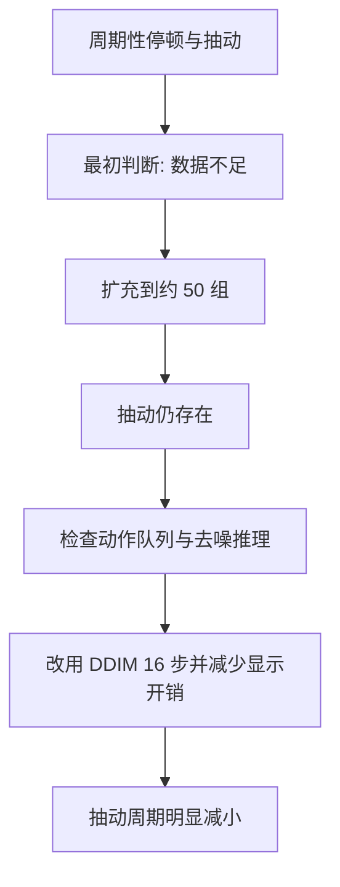

# “一段一段运动”的定位过程

[返回本分支 README](../README.md) · [返回 `main`](https://github.com/Zeil6/lerobot-so101-imitation-learning/tree/main)

## 现象

ACT 部署时动作相对连续，而 Diffusion Policy 初始部署时出现一段一段运动、周期性停顿和抽动。我的第一判断是示范数据太少，因此把数据扩充到约 50 组；但抽动仍然存在。

这次失败很重要：它否定了“只要继续加数据，所有抽动都会消失”这一过于简单的解释。

## 原配置线索

根据当时配置，关键参数包括：

```text
noise_scheduler_type=DDPM
num_train_timesteps=100
num_inference_steps=None
n_action_steps=8
horizon=16
```

动作队列执行 8 步后，需要生成新的动作块。扩散策略不是一次普通前向传播直接输出最终序列，而要进行多轮反向去噪。当 `num_inference_steps=None` 沿用完整调度形态时，100 步 DDPM 对真机控制循环造成了明显计算压力。

## 判断如何被修正



我把部署调整为：

```text
noise_scheduler_type=DDIM
num_inference_steps=16
use_amp=true
display_data=false
```

修改后机械臂的抽动周期明显减小。这个结果说明推理延迟是主要原因之一；措辞保留“之一”，因为目前没有把动作块分布差异、通信延迟和视觉处理耗时全部独立控制。

## 为什么增加数据不能解决推理延迟

增加数据可能改善策略对状态和动作分布的学习，但不会让每次反向扩散自动从 100 次计算变成 16 次。数据质量与计算时延属于不同问题层。只有在先区分“动作内容不合理”和“正确动作来得太晚”后，数据扩充才有明确目标。

## 动作块边界为什么可能不连续

每次生成新块时，扩散策略从新的随机噪声开始采样。即使观测相近，随机初值和多模态动作分布也可能产生略有差异的未来序列。当旧队列的最后一个动作与新块的第一个动作不够一致，真机上会出现速度或位置指令跳变。

这不是简单说“扩散算法不好”。它提示我部署时需要同时考虑：是否复用上一块信息、是否重叠预测并融合、是否对首尾动作做连续性约束，以及推理期间机器人实际已经运动了多远。

## ACT 为什么通常更快

ACT 通常通过一次前向传播产生 action chunk，并可利用 Temporal Ensembling 融合重叠预测。Diffusion Policy 则需要多轮去噪才能得到动作序列，因此在相同硬件上通常有更高的单次生成开销。DDIM 用更少的确定性/非马尔可夫式采样步骤近似完成生成，使部署速度更可控。

## `n_action_steps` 的取舍

| 设置倾向 | 可能收益 | 可能代价 |
| --- | --- | --- |
| 较短 | 更快利用新观测，闭环纠偏更频繁 | 更频繁触发昂贵推理；块边界更多；来不及推理时容易停顿 |
| 较长 | 推理调用次数下降，队列更不容易耗尽 | 开环时间变长；场景变化后仍执行旧动作；误差可能累积 |

控制频率决定每个 action step 的实际时间。若控制频率为 `f`，执行 `n_action_steps` 的开环窗口约为 `n_action_steps / f` 秒。新的动作块必须在队列耗尽前准备好，否则停顿很难避免。

## 下一步验证

- 记录 DDIM 10/16 步的平均和高分位推理耗时，而不只看主观顺滑度。
- 在相同 checkpoint、初始位置与控制频率下比较不同 `n_action_steps`。
- 标记每次块切换，判断抽动是否与边界严格对齐。
- 评估重叠动作块融合，但同时测量融合带来的滞后。

